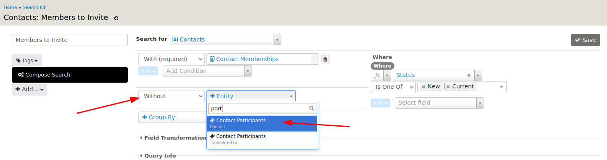
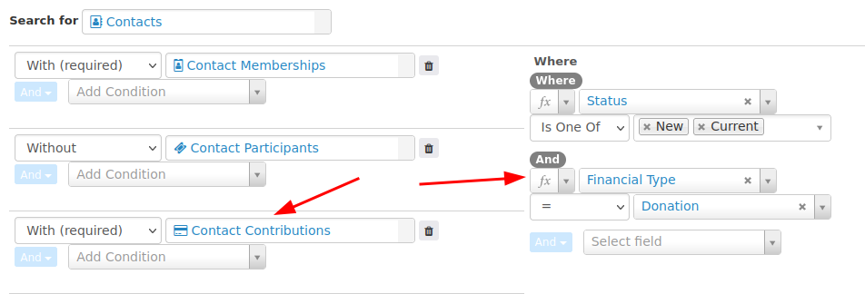
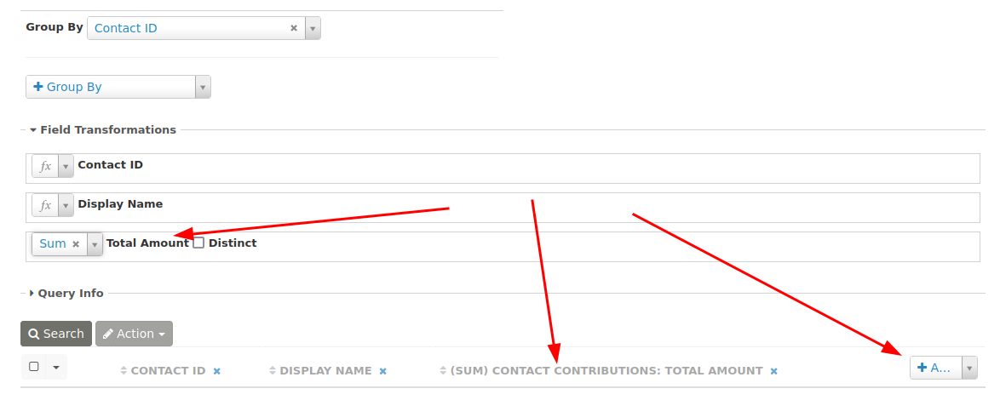
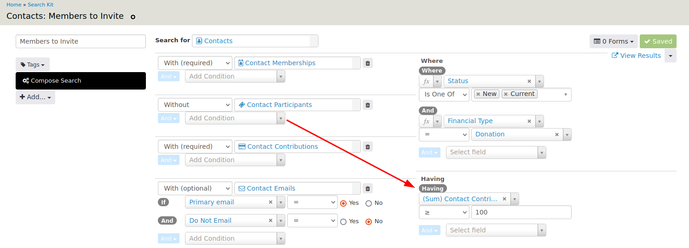
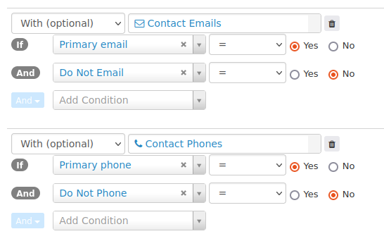
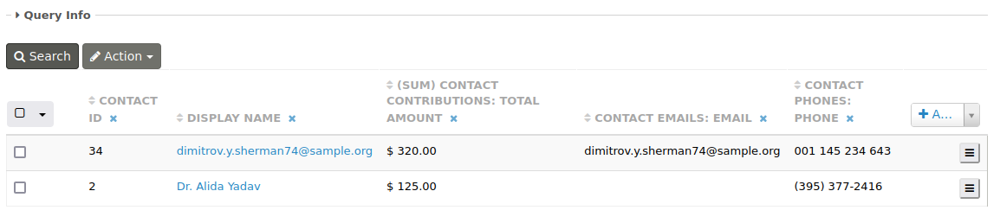
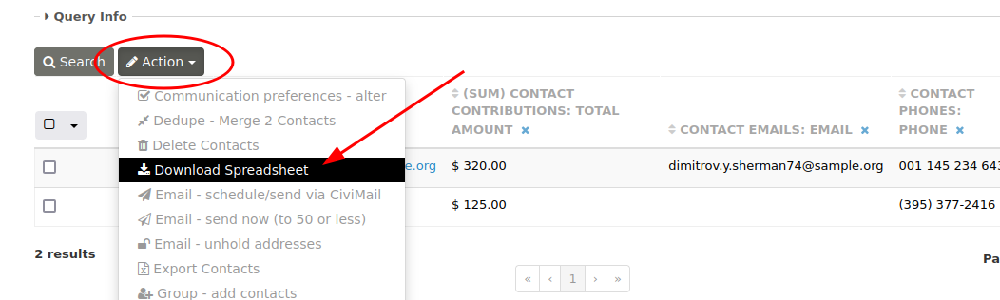

# Example: Donor Members to Invite

Imagine a scenario in which an organization wants to invite members who are major donors that have not previously attended an event to an upcoming one.

With SearchKit, an invitation list that meets the above critera is easily doable! The following demo will walk through the setup for this scenario, step by step.

## Step 1: Select Current Members

After clicking on **New Search** from the SearchKit page, the base entity to **Search for** must be decided. This cannot be changed once the search has been saved.

In this example, there is an option to start with Contacts and then link the Memberships, or start with Memberships and then link the Contacts.

Because the desired result is ultimately a list of contacts, it makes the most sense to choose Contacts as the basis of the search, so select **Contacts** from the **Search for** drop-down menu. Then change the **With (optional)** selection to **With (required)** and select **Memberships** from the **+Entity** drop-down menu.

Since the invitation list should only include active members, add a filter on membersip status. To do so, change Status to **is one of** New and Current under the **Where** section.

Fill in a name for the search and click **Save**.

Feel free to click the **Search** button to preview the results.

## Step 2: Members Who Never Attended an Event

To retreive a list of members who have never attended an event, the search needs to look for contacts without a participant record. To tell SearchKit to look for these individuals, change a second **With (optional)** field to **Without** and select Contact Participants.

## Step 3: Donors

To further narrow this list to only include major donors, another filter is needed. Change a third **With (optional)** to **With (required)** and select Contact Contributions as the entity. Under the **Where** section, add a clause that sets Financial Type **=** Donation.

A contact may have multiple donations, so to ensure that each individual is only listed once, select Contact ID from the **Group By** drop-down menu.

When Group By is used, it enables an option to add a Field Transformation, such as combine, count, or sum. In this example, the total amount of contributions by each contact should be summed. To do this, first add a column to the search results by clicking **+Add** and then selecing **Total Amount**. Under the **Field Transformation** section above the search results, select **Sum** from the drop-down menu next to the Total Amount field.

## Step 4: Major Donors

The data can also be filtered to include donors who have contributed a certain amount. This is done by adding a condition on the sum of the total amount. Since this condition is based on a field transformation, use **Having** instead of **Where**, so that (Sum) Contact Contibution is set to greater than or equal to a specified amount.

## Step 5: Email and Phone Number

Since this search is meant to produce an invitation list, the contact's primary email and phone number should be added as entites.

!!! Note:
  * It may be the case where not every contatc will have an email and/or phone listed in the database, which is why **With (optional)** is recommended. 
  * A contact may have specified that they do not want to be phoned or emailed. This is shown on theirContact Summary and needs to be taken into account.

The final results of this configured search will likely look something like this:

## Step 6: Export as CSV File

Click on the **Actions** button above the search results. This will provide a list of available actions that can be preformed on the search results, such as downloading the data as a spreadsheet (CSV file). 

