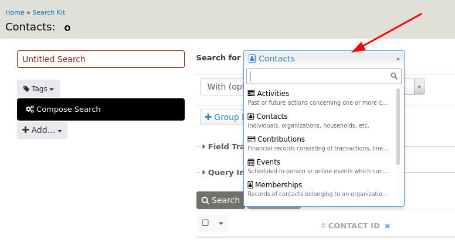
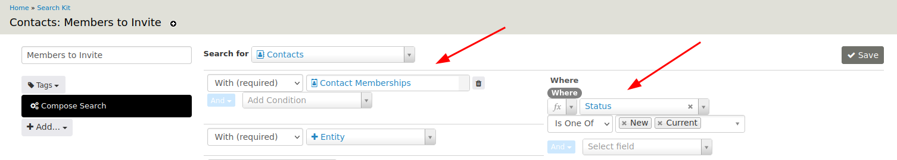

# Example: Donor Members to Invite

Imagine you have an event, and want to personally invite members who are also major donors but have not attended any of your events yet.

Let's build this search step by step. 

## Step 1: Select Current Members

We need to select members. What will be the enitity to select in 'Search for' ?

This choice is important because you cannot change this base entity after you saved your search.

In this example, we have the option to start with Contacts and then link the Memberships, or start with Memberships and then link the Contacts.

Because we ultimately want a list of contacts, let's take Contacts as the base of our search.

Add **Contacts** in 'Search for' with (required) **Memberships**.

We only want to see active members, so we need to filter on the membership status. 

Add **Where** 'Status' is one of 'New' and 'Current'.

Fill in a name for the search and click 'Save'.

Feel free to click the 'Search' button to preview the result.

## Step 2: Members Who Never Attended an Event

We want a list of members who never attended an event. This actually means contacts without a participant record.

## Step 3: Donors

We want to filter this list even more, by selecting members who are major donors.

Let's add the link with Contributions, with **Where** 'Financial Type' = 'Donation'.

Because a contact can have multiple donations, and we want a contact to be listed only once, we need to **Group By** Contact ID.

When you use Group By, you have to specify a transformation for fields to combine, count, sum...

In our example, we want to sum the total amount of the contributions for each contact.

So we add the column 'Total Amount' and the field transformation:

## Step 4: Major Donors

If we want to select only donors who donated a certain amount, we can add an extra filter on the sum of the total amount.

Because this is a field with a transformation, we need to use **Having** instead of **Where**.

## Step 5: Email and Phone Number

We can now add the primary email and phone number.

Please note:

 * Not everybody has an email address or phone number, that's why we add 'With _(optional)_'.
 * On the Contact Summary, you can specify that a contact does not want to be phoned or emailed. We need to take this into account.

The final result might look like this:

## Step 6: Export as CSV File

The list can now be exported as a csv file and sent to the person who is going to reach out to these donor members:

