# Case: Creating a Public Membership List

There are many use cases for showing structured data from CiviCRM on a public page of a website. As an organization with several levels of membership, for example, it would be useful to have filterable and searchable lists on your website that are populated by live data from CiviCRM. With the help of Searchkit and Form Builder, this is an easy feature to add!
 
The following demo will show, step-by-step, how to create a Logo Grid with tooltips and links to external(e.g. members') websites that can be filtered by (membership) type.

## Step 1: Create a New Search and Define the Data

Go to **Administer > Search > Searchkit** and click **New Search**.

Then:

* give the search a title name (e.g. "Our Members") in the box labeled "Untitled Search" 
* select Memberships from the **Search for** list
* add a **With** for Membership Contact so that data can be pulled from the member's contact record (e.g. the display name to show in a tooltip) 
* add a second **With** for Contact Websites as this will give access to the link of the member's homepage

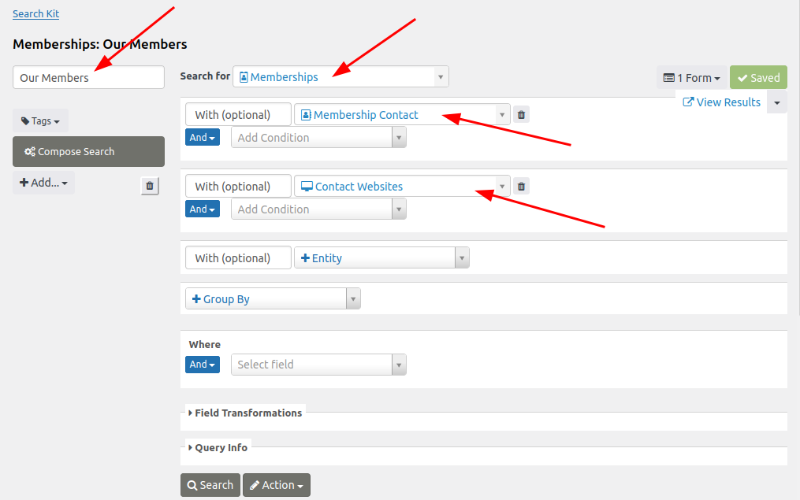

Tap **Search** to check the results of the current configuration. The above criteria returned six memberships as a result. Note that when adding Membership Contact and Contact Websites, Searchkit automatically added some columns with data from these sources:

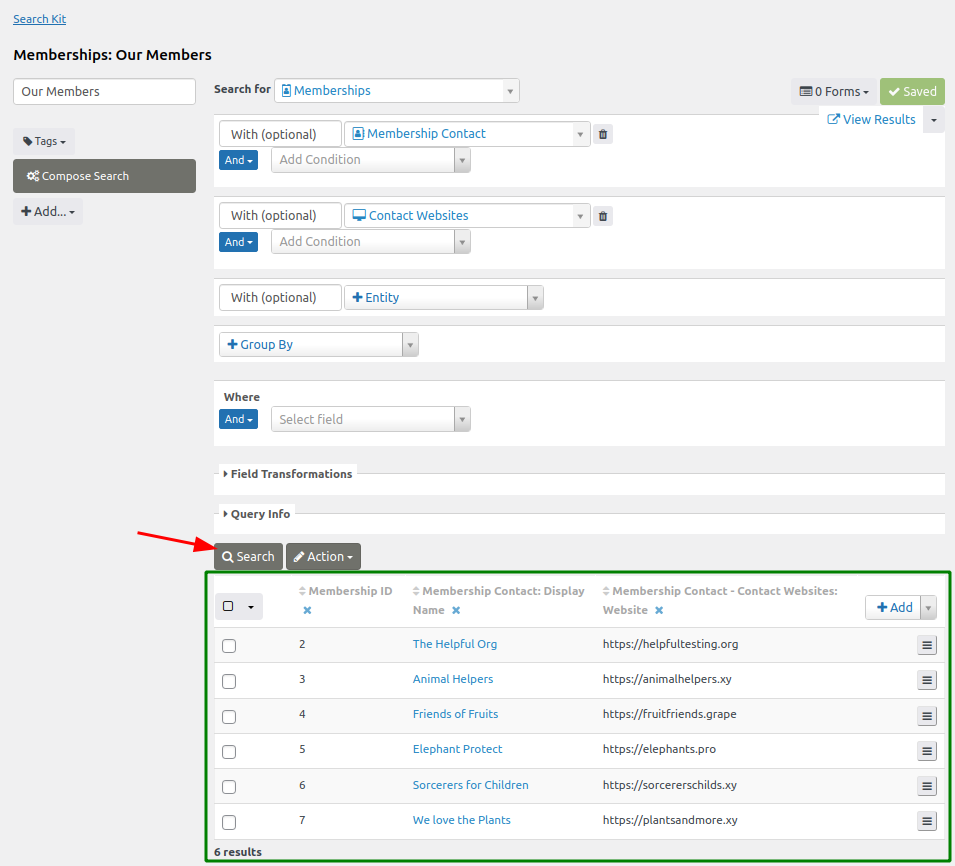

## Step 2: Add Columns to Output Additional Data

The columns displayed determines the data that are returned from the search. These results can be customized, such as by adding a new column for the URL of the logo.
To do this:

* tap the **+Add** button on the top right of the results table
* choose the desired column to display (e.g. Membership Contact: Image URL)
* refresh the results display by clicking **Search**

This particular selection means that the standard contact image is choosen. To use custom fields, like a different image, requires first adding another data source.

The results will now look like this:

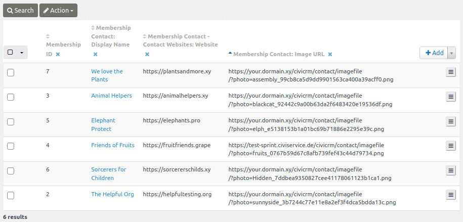

!!! Tip
    Don't forget to **Save** your work.

## Step 3: Adding and Configuring a Grid Display

To format the search results, a display must ne added, which can be done by clicking the **+Add** button underneath the search's title field. A Grid display best suits this demo so that the output can be organized into tiles.

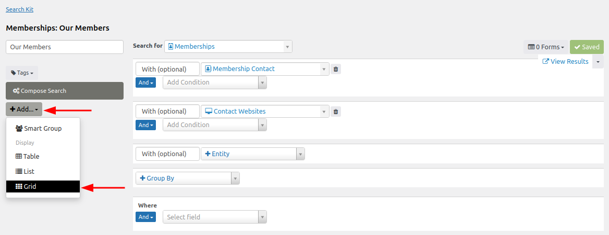

Give this display configuration a title (e.g. "Our Members"). By default, Searchkit will now add all the fields (columns) of the search to the new display. These fields can be further customized, including dragging and dropping them into a new order.

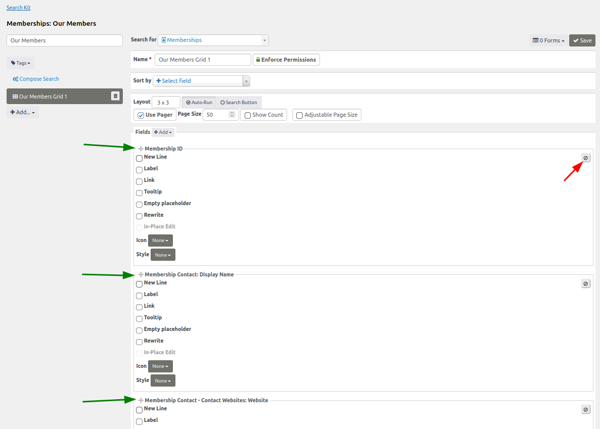

Clicking **Preview** will provide the results in a 3x3 pattern grid directly below the button at the bottom of the page. However, at this stage, the display does not meet the desired output. To achieve the logo display:

* **Remove** all items that are not needed by clicking on the remove symbol (indicated by the red arrow in the screenshot above) in each item's section. Only leave Membership Contact: Image URL for this example.
* Check the **Image** checkbox to display the logo as an image.
* (Optional) Set size attributes to make the logo sizes match (e.g. adjust the height to 200px).
* Check the **Link** checkbox, select **'Other...'** from the dropdown menu, select Membership Contact - Contact Websites: Website from the **token dropdown**.
* **Attention:** remove `/civirm` from the front of the token: 
  `civicrm/[Membership_Contact_contact_id_01_Contact_Website_contact_id_01.url]` 
  so that it becomes:
  `[Membership_Contact_contact_id_01_Contact_Website_contact_id_01.url]`
  as the `/civicrm` portion would inhibit the url from reaching the member's external website.
* Check the **Tooltip** checkbox and make sure the ;abel that pops up to the right is a token for the Display Name.

Click **Refresh** to see the logos displayed as intended:

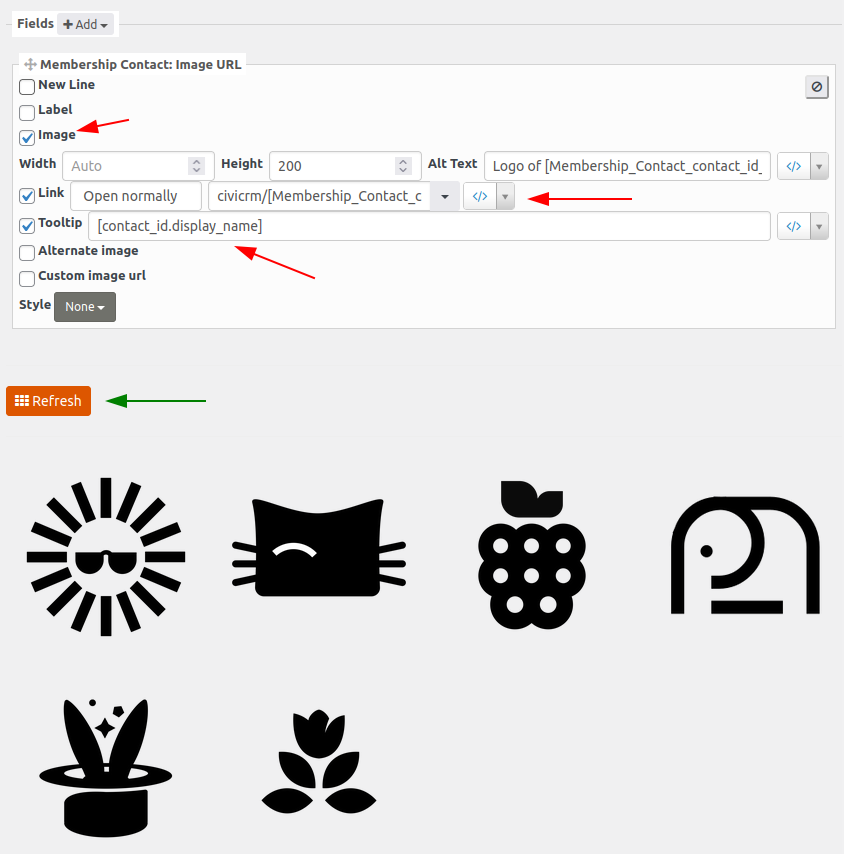

!!! Note
    This configuration will only show members who have logos associated with their record. To include those without logos, check the **Alternative image** box.

## Step 4: Adding and Configuring a Form

In order to show the results on a public website, a Form needs to be created. Return to the Searchkit dashboard and click **Forms > + Create Form for Our Members Grid**:

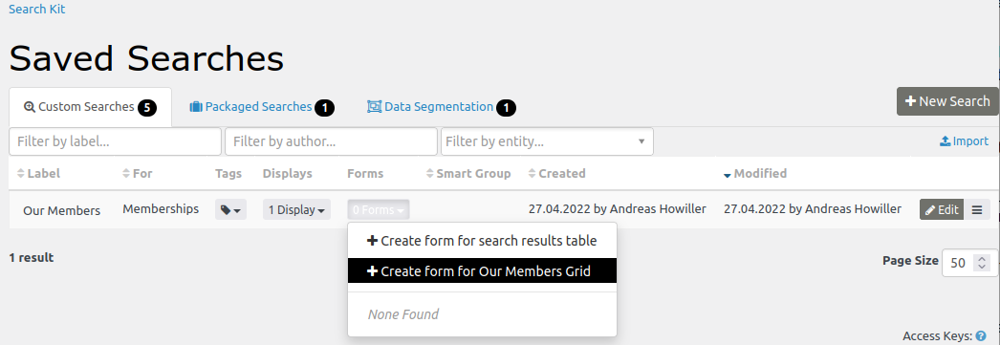

Then:

* Give the Form a name and a description.
* Enter the URL for the page on which you want the results displayed (e.g. 'civicrm/members').

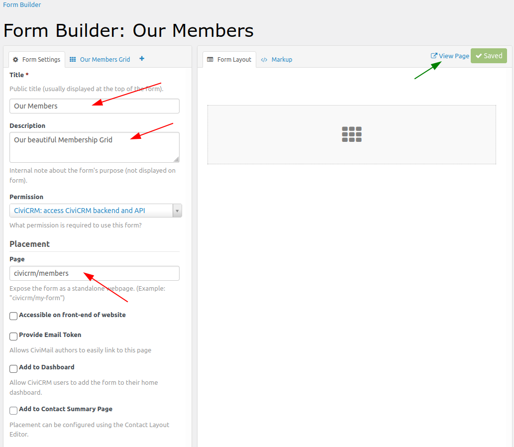

After clicking **Save**, the link **View Page** will appear. This link will show the fully formatted results grid.

To filter which membership types are shown, switch from the **Form Settings** tab to the **Our Members Grid** tab and drag the item Membership Type into the **Form Layout** tab.

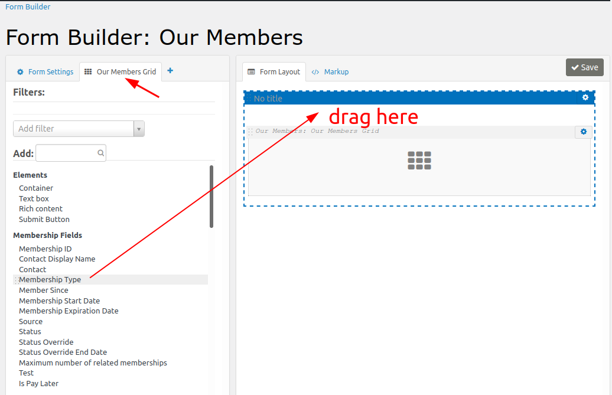

Then:

* Change the preset of the filter so that it shows the desired membership types. 
* Change the layout details, such as the title of a container element.

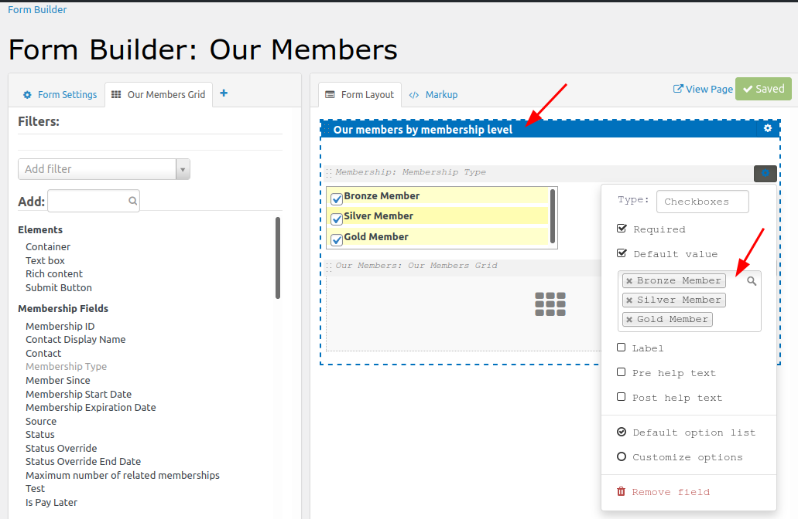

So long as you are logged into your CiviCRM account, the specified URL (e.g. your.civicrm.tdl/civicrm/members/) will display the configured Form.

## Step 5: Setting Permissions

The last step in this process is to allow the form to be accessible for anonymous users. To do so, return to the search's display configuration and unlock (by clicking) the **Enforce Permissions** button. Once clicked, the button will read **Bypass Permissions**, as shown below.

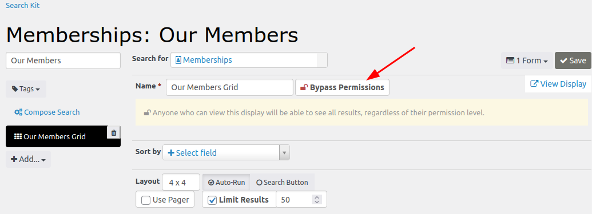

Don't forget to **Save** before going back to the Form configuration.

Who can view the page that contains the results grid can now be defined. To make the displaay viewable on a public website:
* Remove all restrictions by selecting 'Generic: Allow all users (including anonymous)' from the dropdown list. 
* Check the **Accessible on front-end of website** box.

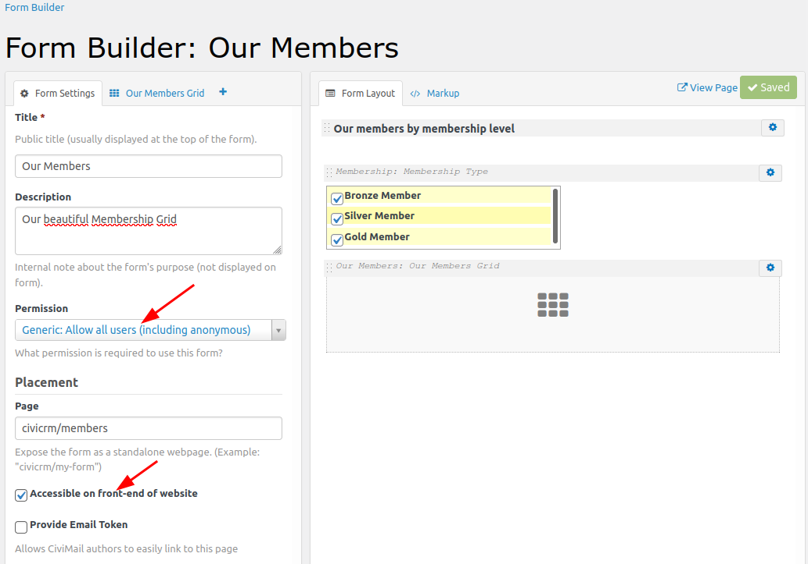

Now users, whether logged in or not, will be able to view and filter the form.
