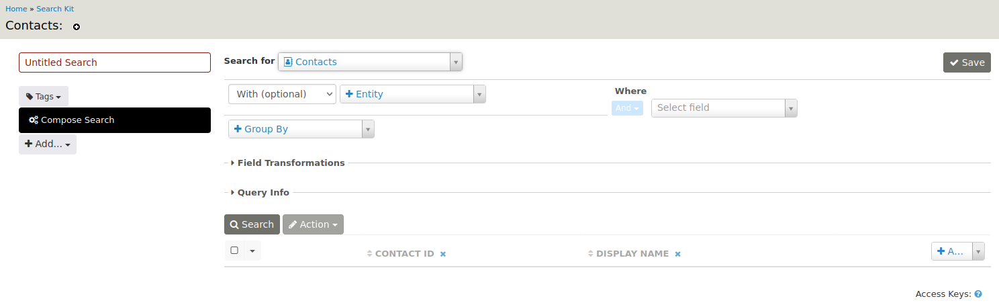
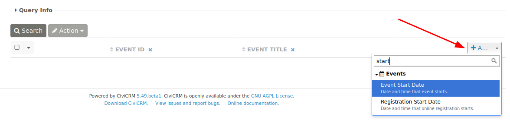

# Example: Upcoming Events

When you click the **Event** tab from the toolbar and then select **Manage Events**, the default event overview looks like this:

Searchkit gives the option to create an alternative to the Manage Event overview screen that could be customized in many ways:

This Searchkit built event overview includes features such as:

 * a clickable event title that leads to the event's Info and Settings page
 * a list of speakers and hosts for each event
 * the number of registered/attended participants 
 * the number of cancellations/no-shows
 * the ability to click on the registered/attended or cancellations/no-shows numbers to view a list of participants with that status

This section will walk through how to create the above functionality step by step.

## Step 1: Create a New Search

Go to **Administer > Search > Searchkit** and click **New Search**.

Then:

* fill in the name of the search (e.g. Upcoming Events)
* select Events from the **Search for** list
* in the **Where** section of the form, filter for upcoming events by using the drop-down fields to select **Event Start Date**, then **>=**, and finally **Now** (note that you can also **Pick a Date** or tailor the search with other options).

!!! Tip
    Don't forget to **Save** your work.

Click **Search** to view the result.

## Step 2: Add Event Columns

By default we see the event ID and event title. For this example, we will also want to display the event start date.

You can do this by selecting that column from the list on the right-hand side.

## Step 3: Add Participant Information

So far, we only have event information. We also want to show the host(s) and speaker(s) of the event. This information comes from the participants.

We will add this entity:

...with a filter on role in **Where**:

We use Contains because a participant can have multiple roles, and these roles are stored in the participant role field.
The participant role should be either Speaker or Host.

Lastly, we add the entity Participant Contact to be able to show the name of the speakers and hosts.

The search now looks like this:

## Step 4: Grouping on Event ID

If you run the search at this point, you will notice that an event is listed multiple times if you have more than one speaker or host. We can avoid this by grouping on event ID.

The search will display the speakers and hosts in a comma-separated list thanks to a field transformation:

## Step 5: Add the Number of Participants

Our next task is to add the number of participants.

To achieve this we need the field transformation **Count** on the field Participant ID.

But... if we do this right now, we count only the hosts and speakers because of the filter in **Where**.

The trick is to add Event Participants again as an entity:

To display a count of the no-shows and cancellations, add another Event Participants entity.

Add the Participant ID (2 and 3) columns by clicking **Add** on the upper right side of the search results display. Then, under **Field Transformations**, select **Count** and check the **Distinct** box next to the Participant ID (2 and 3) labels:

## Step 6: Change Column Names and Sort Order

To be able to change the column names, we need to first create a table display. Click the **Add...** button on the left side of the form (under **Compose Search**) and select **Table**.

Give the display a name and add a Sort By:

Scroll down and give the columns a meaningful name in the Header fields.

The preview might look like this now:

## Step 7: Make the Values Clickable

To make the number of participants clickable, we will add a **Link** to their respective overview page.

The link to enter for the registered/attended count is:

 * civicrm/event/search?reset=1&force=1&event=[id]&status=true

The link to enter for the cancelled/no-show count is:

 * civicrm/event/search?reset=1&force=1&event=[id]&status=false

If you want, you can add a **Link** for the event title as well:

 * civicrm/event/manage/settings?reset=1&action=update&id=[id]

This will lead to the Info and Settings page of the event.

The final result looks like this:

## Step 8: Add Optional Filtering

We can add a form on top of the upcoming events list for optional filtering.

In the upper right corner of the search, we find a button to do that:

This will bring us to the form builder. Give the form a name and a page link:

Click on the tab **Upcoming Events Table**. Drag and drop the form elements to the form layout pane:

You probably want to add a Container first in order to nicely layout the other form elements.

## Step 9: Add the Overview in the Navigation Menu

In the previous step, we specified a page link for our form: **civicrm/upcoming-events**.

We can create a new navigation menu item with this link.

See **Administer > Customize Data and Screens > Navigation Menu**.

As a result, your users have a convenient way to access the upcoming events:

This will lead to our finalized search form:

