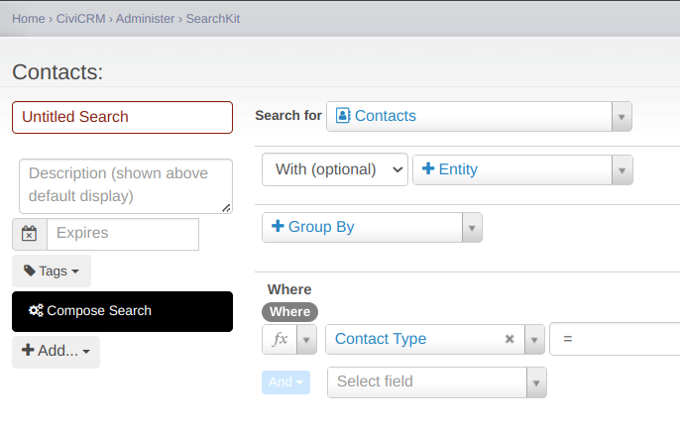
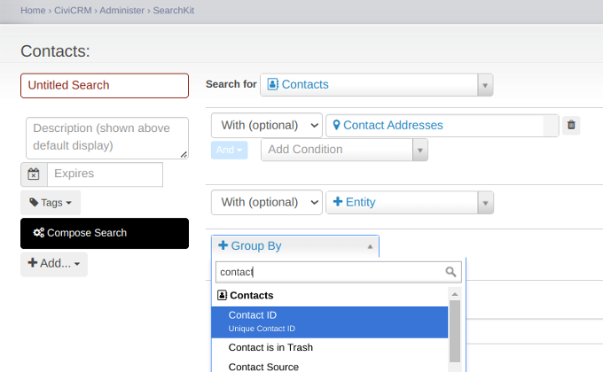
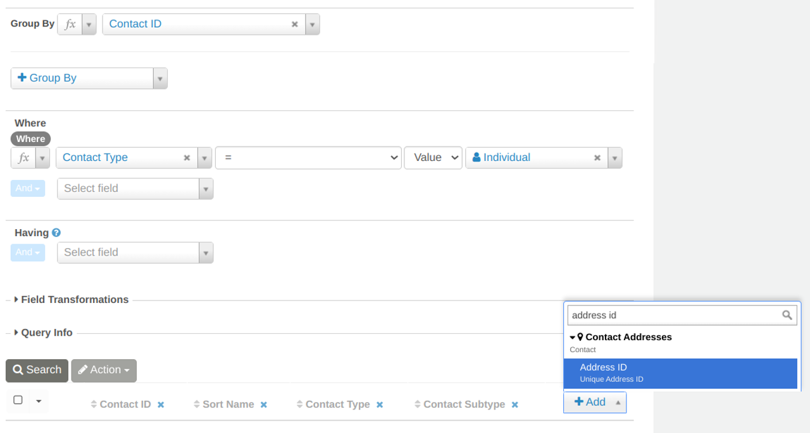

# Group By 

Use 'Group By' to categorize your data by one or more fields. This results in one row per value in those fields, and potentially counting, totalling or averaging numeric information or concatenating text data in other exposed fields.

## Description

'Group By' is a feature that lets you organize data around a common element (entity / thing). This feature is ideal for analyzing patterns and relationships within your data, such as counting, totalling or averaging numeric information or concatenating data in other fields. 

For example, if you're looking at contacts and their addresses, you could for example group them by Contact ID.

If you then also add the field Address ID to the result you will automatically count all addresses on a contact. This approach shows you how many addresses each contact has.

## Option Details

If the section being described has a long list of options that have a one sentence description in the UI then probably start by just listing all of those options in an unordered list.
