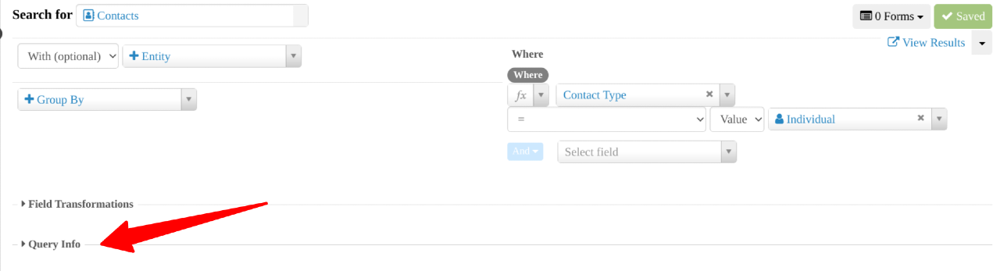

# Query Info

Query Info presents you with the underlying code behind your search in API and SQL format. It can be copied and used outside of SearchKit if needed. It is optional and recommended for use by users that are comfortable directly using the API and SQL commands.

## Description

Explain the options and what they do to the search results, for example, list each option available in a dropdown and say what each will do, or if list is variable and too long, explain in more abstract terms.

## Option Details

If the section being described has a long list of options that have a one sentence description in the UI then probably start by just listing all of those options in an unordered list.
