# Example Soft Credit Search and Display

In this example we are going to create a Soft Credit search and a table display. 

!!! Note "A little background on Soft Credits"
    Soft Credits in CiviCRM are a way to keep track of someone you should also thank for a contribution other than the donor. For example, if I ask people to donate for my birthday and John Doe contributes 25 euro I can get recognition for that with a soft credit. For more information read the [Soft Credits section](../../contributions/soft-credits.md).

In this search, data will be combined from the contact that has the Soft Credit with data from the contact that actually made the contibution as well as with data from the contribution itself. This should show us who our best contribution sollicitors are! The outcome will be something like this:

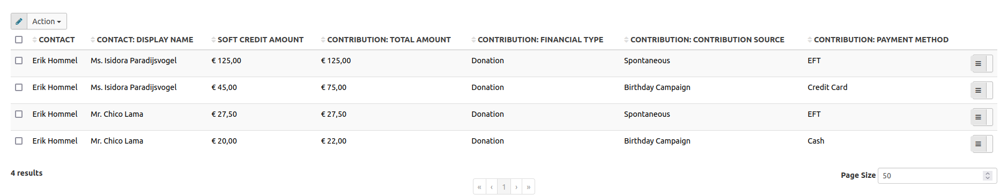

## Starting from the Saved Searches

The first step is to navigate to Search Kit from the **Search** menu. You will then see a page with saved searches like this:

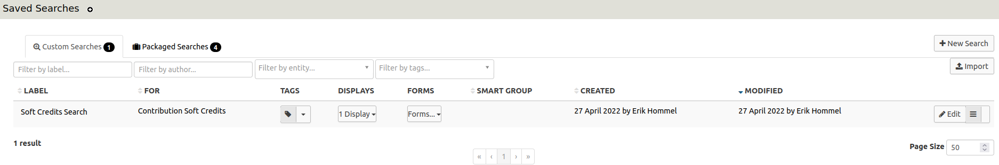

This page gives an overview of the existing searches. As you can see, the Soft Credit example is already on the list but we are now going to create a new one step by step. To begin, click on the **New Search** button.

## Creating the Search

After clicking the **New Search** button, you will get an empty form where you can create the search:

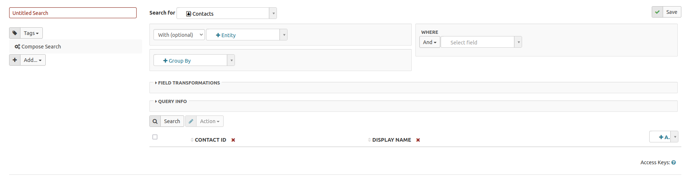

On the left you will see a text box with **Untitled Search**, where you should enter the name of your search. For example, this search is named "Soft Credit Example Search".

Below that name you will see a selection box for tags. You can add a tag to a search which will allow you to categorize your searches, for example all Fundraising searches.

Right under that box is an **Add** selection box, which we will ignore for now but will discuss in the [Adding a display](#adding-a-display) section of this chapter.

The next step is to select the entities from where we want the data.

### Selecting entities

At the middle top of the form, you can choose for which entity to search. Initially it will have the value Contacts:

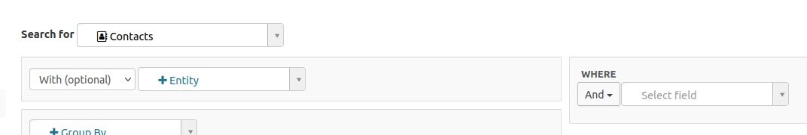

The list of entities you can choose from is quite extensive. 

For this example, the Contribution Soft Credits entity is initially selected. This will return the contacts that have the Soft Credit, the ID of the contribution the Soft Credit is linked to, the amount of the Soft Credit (which can be different from the contribution amount) and the type of Soft Credit. 

If you also want to include information about the actual contribution and the contact that made it, you will need to specify those entites.

To do so, add the additional desired entities by clicking on the **+Entity** select menu next to the **With (optional)** box. Search Kit will work it out by itself how to link those entities, so it will know it needs to use the contribution ID to link to the Contribution and the contact ID in the contribution to link to Contact.

Additional conditions may be added. In this example, the contributions will be limited to those that have a financial type of Donation to filter out payments for Memberships or Events.

Selection criteria for the search can be added via the **Where** box. In this case, the contributions will be limited to a date range of 1 Jan 2021 to 30 April 2022.

Below is a screenshot of all the entities and conditions selected up to this point:

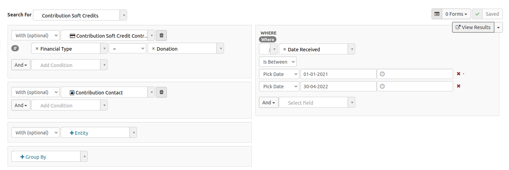

Although it will not be used in this example, there is also a **Group By** box. This field allows the user to select how the results will be grouped, such as by **Contact Display Name**.

The next section will cover how to select the which fields are returned from the search.

### Selecting the fields

At the bottom of the form, select which fields the results of the search should display. The default setting typically includes an ID and sometimes a name:

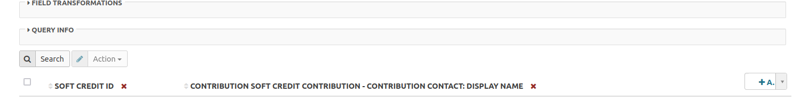

To run the customized search and display the data, click the **Search** button above the field names.

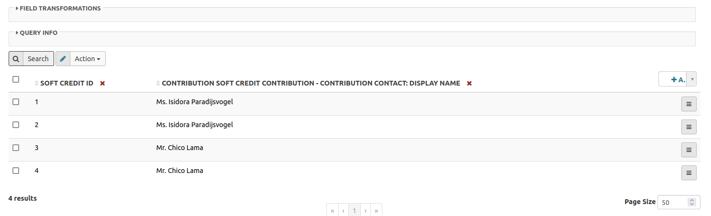

Next to the **Search** button there is an **Action** box. This feature allows for several actions, but the default is to download the results as a CSV file. This standard action can be switched off, which will be shown later.

On the right side of the form, there is an **Add** button from which you can choose additional fields from the selected entites to be included in the search results:

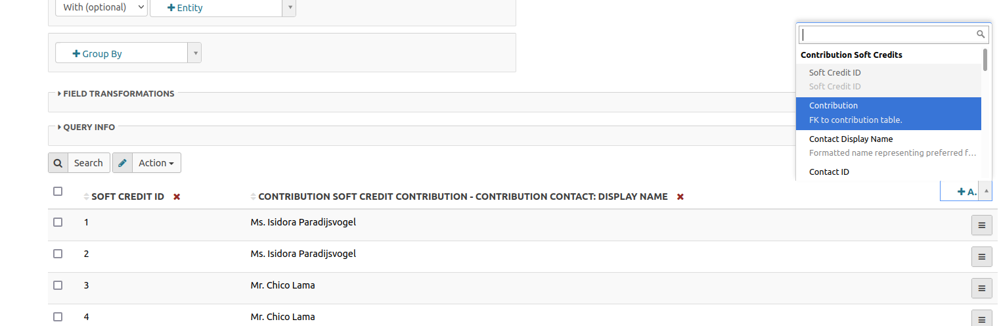

In this example Soft Credit ID is removed, the name of the Soft Credit contact is kept and the following fields are added:

  * the soft credit amount
  * the soft credit type
  * the name of the contributing contact
  * the contribution total amount
  * the contribution date
  * the contribution source
  * the contribution status
  * the contribution payment method

Once the fields have been customized, click **Search** again for an updated reults display:

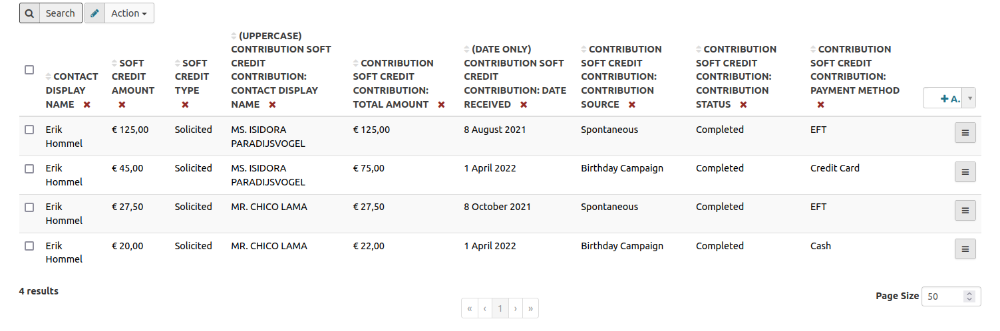

The next section will cover how to transform some of those fields.

### Transforming fields

Just below the entities section, there is a section captioned **Field Transformations**. 
When clicked to expand, this section provides a list of the fields that are included in the search with options to transform (i.e. customize with functions) each of those fields.

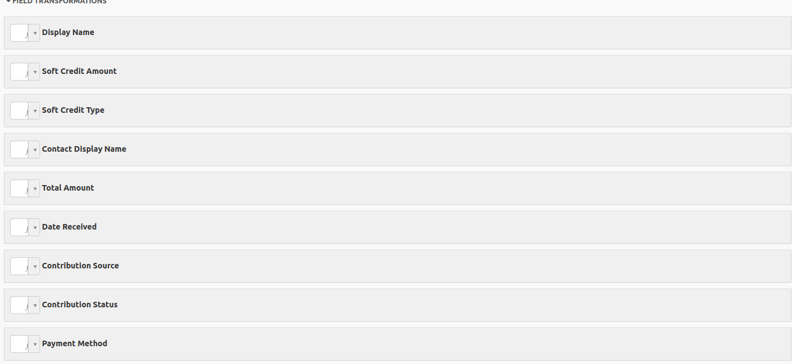
 
 To make the Contact stand out in this example, the Uppercase function is selected next to the Contribution Contact Name label. To exlude the timestamp of when the contribution was recived, the Date Only option is selected next to the Contribution Receive Date label.

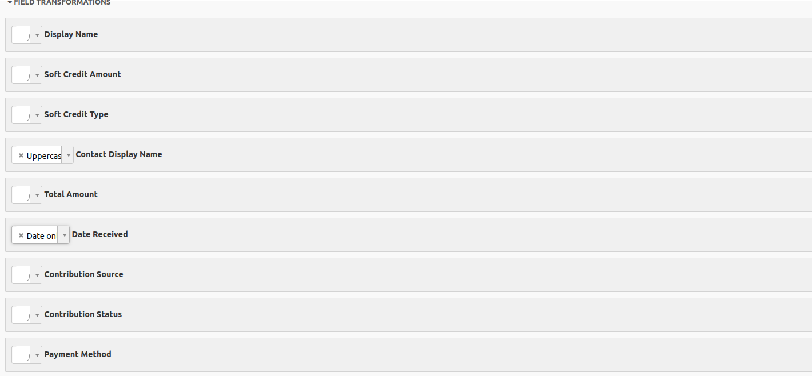

Click **Search** to view the transformed results:

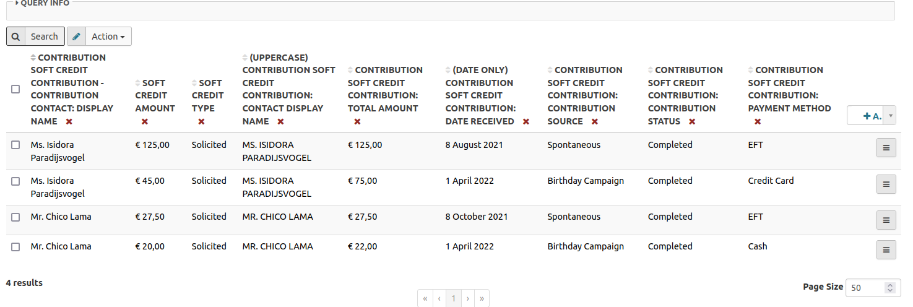

### Having a look at the query

Just below **Field Transformations**, there is a section named **Query Info**. This section shows the technical translation of the selected entities and fields, which is useful for developers. If you are not technically oriented, this can be ignored.

For the Soft Credit example, the query will be displayed as:

```
{
  "version": 4,
  "select": [
    "ContributionSoft_Contribution_contribution_id_01_Contribution_Contact_contact_id_01.display_name",
    "amount",
    "soft_credit_type_id:label",
    "UPPER(ContributionSoft_Contribution_contribution_id_01.contact_id.display_name) AS UPPER_ContributionSoft_Contribution_contribution_id_01_contact_id_display_name",
    "ContributionSoft_Contribution_contribution_id_01.total_amount",
    "DATE(ContributionSoft_Contribution_contribution_id_01.receive_date) AS DATE_ContributionSoft_Contribution_contribution_id_01_receive_date",
    "ContributionSoft_Contribution_contribution_id_01.source",
    "ContributionSoft_Contribution_contribution_id_01.contribution_status_id:label",
    "ContributionSoft_Contribution_contribution_id_01.payment_instrument_id:label"
  ],
  "orderBy": [],
  "where": [
    [
      "ContributionSoft_Contribution_contribution_id_01.receive_date",
      "BETWEEN",
      [
        "2021-01-01 11:09:00",
        "2022-04-30"
      ]
    ]
  ],
  "groupBy": [],
  "join": [
    [
      "Contribution AS ContributionSoft_Contribution_contribution_id_01",
      "LEFT",
      [
        "contribution_id",
        "=",
        "ContributionSoft_Contribution_contribution_id_01.id"
      ],
      [
        "ContributionSoft_Contribution_contribution_id_01.financial_type_id:name",
        "=",
        "\"Donation\""
      ]
    ],
    [
      "Contact AS ContributionSoft_Contribution_contribution_id_01_Contribution_Contact_contact_id_01",
      "LEFT",
      [
        "ContributionSoft_Contribution_contribution_id_01.contact_id",
        "=",
        "ContributionSoft_Contribution_contribution_id_01_Contribution_Contact_contact_id_01.id"
      ]
    ]
  ],
  "having": []
}
```
### View results

Once a search has been saved (by clicking the **Save** button on the upper right side), a button to **View Results** will be displayed underneath the **Save** button.The results may be viewed throughout the process of customizing the search or once it is completed.

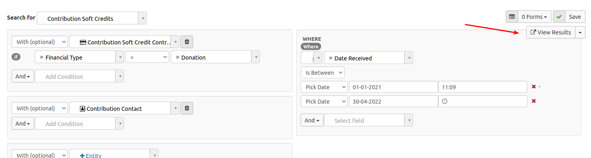

## Adding a display

Once the search criteria has been specified and the results fields selected, you can choose how the results are displayed. Click on the **Add...** button on the left side of the form.

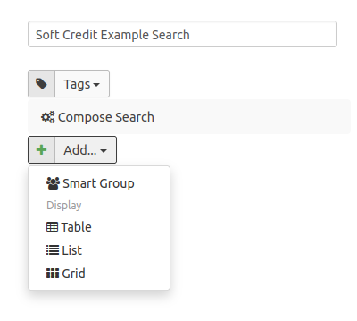

There are different types of displays that can be added, such as:

  * **Smart Group**: creates a smart group of the search results
  * **Table**: shows the results as an overview in table form
  * **List**: shows the results as a (vertical) list
  * **Grid**: shows the results as an unformatted grid

The table option is most common and what will be used in this example.
To start, select **Table** which will then display a form like this:

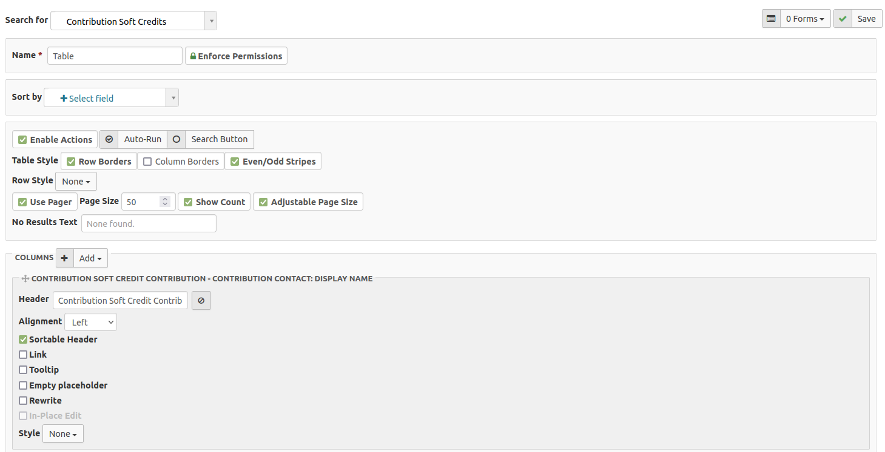

First, give the table a name and then click the **Save** button in the upper right corner.

!!! Tip
    Do not forget to press **Save** regularly when building your search or table so you do not lose your progress!

In the **Sort by** field, select by which fields you want the table sorted. The fields can be sorted in ascending or descending order.

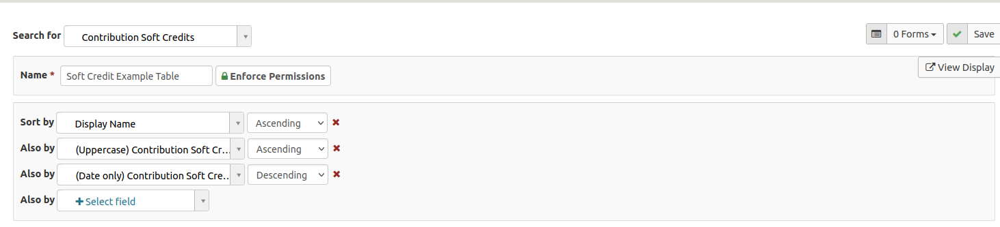

In the section just below that, you can **Enable Actions** on your table, set the **Page Size** (which determines how many results will show per page), the table style, what text to show if no results are returned, and if the search should be run automatically.
In this example, the text for no results has been changed and the rest were left with default values:

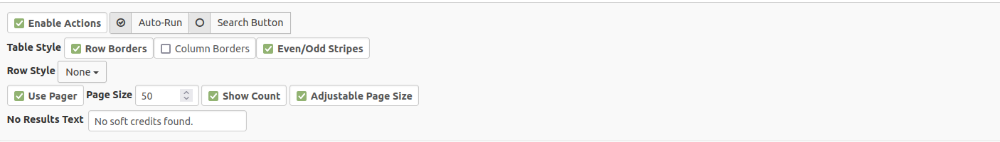

Next, you will see a list of all the fields that are in your search. You can change their order by clicking and holding the handle to move it around:

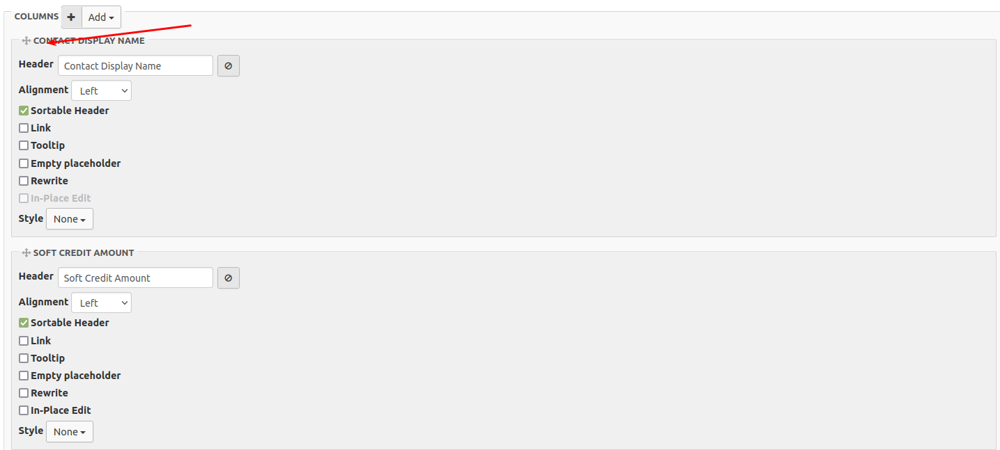

To remove a column, click on the remove icon:

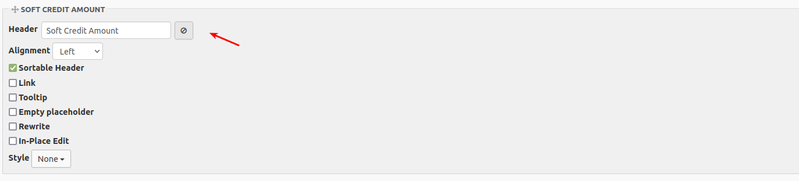

The heading, alignment, and enabling inline-editting can be changed for each column.

To add a column that is in the defined search but not yet displayed on the table, click the **Add** button at the top of the column list. From this button you can also add a link, button, menu, or a bit of custom code

In this example, lets add a menu that allows: 

  * viewing the soft credit contact
  * viewing the contribution contact
  * viewing the contribution

To do this, click the **Add** button and select the **Menu** option:

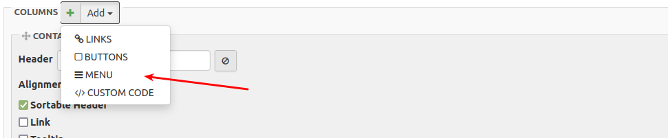

This will add a new menu column at the bottom of the list. The menu can be edited:

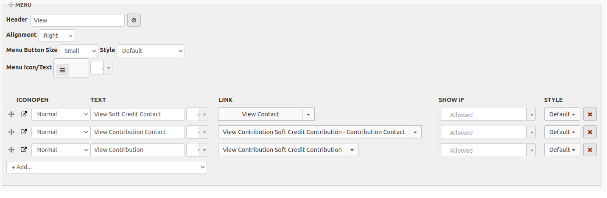

If you click on the **Add...** within the menu section you will get a few suggestions based on the entities you have selected.

Click on **View Results** to see the final table:

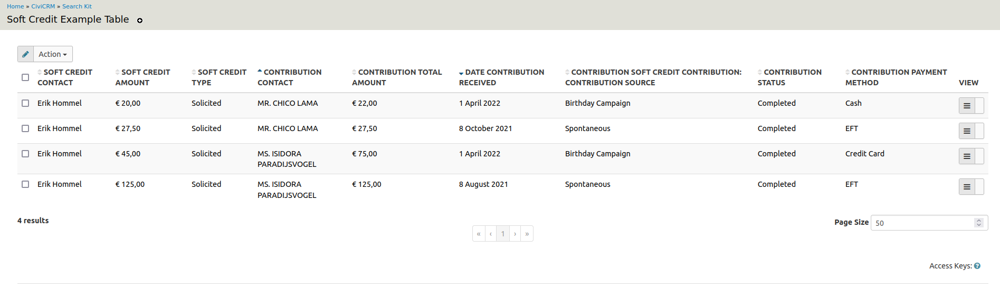

A menu option for the table can be made by copying the URL in the browser:

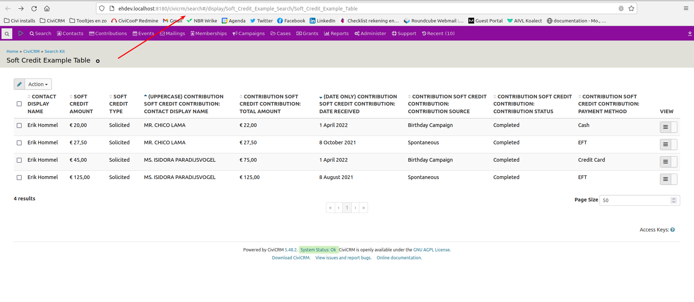

Next, add the URL to the CiviCRM menu by navigating to 
**Administer > Customize Data and Screens > Navigation Menu** and then click on the **Add Menu Item** button:

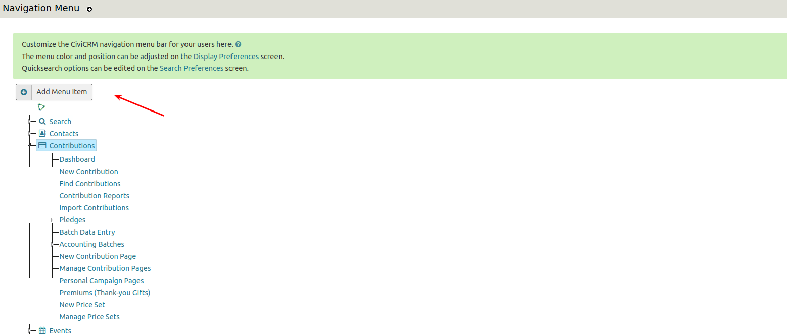

Enter all the options and paste in the copied URL (starting with _civicrm/_ onwards)

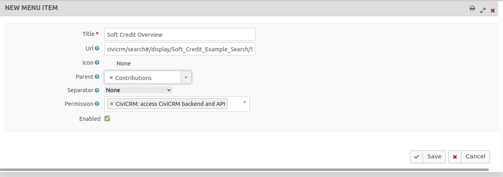
