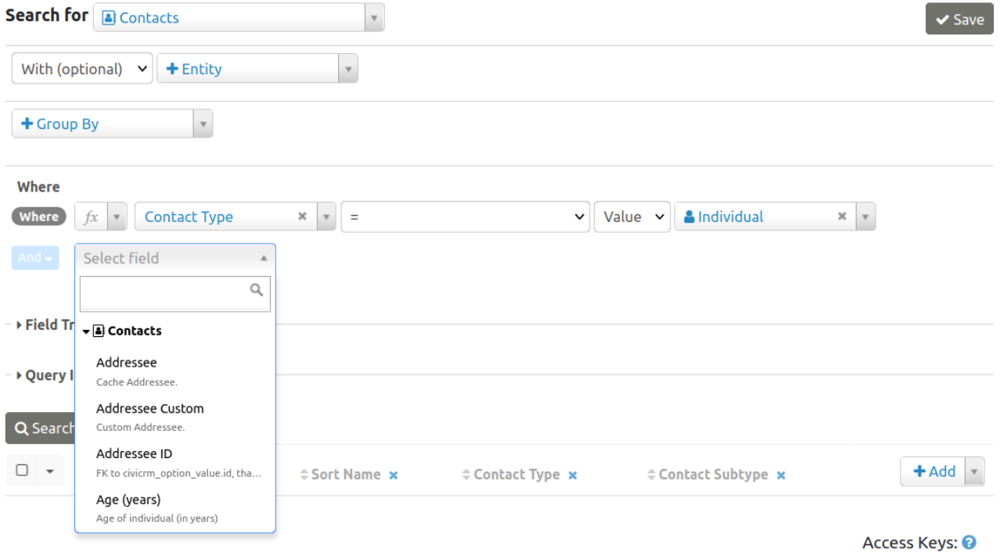
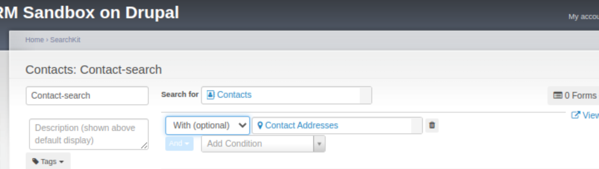
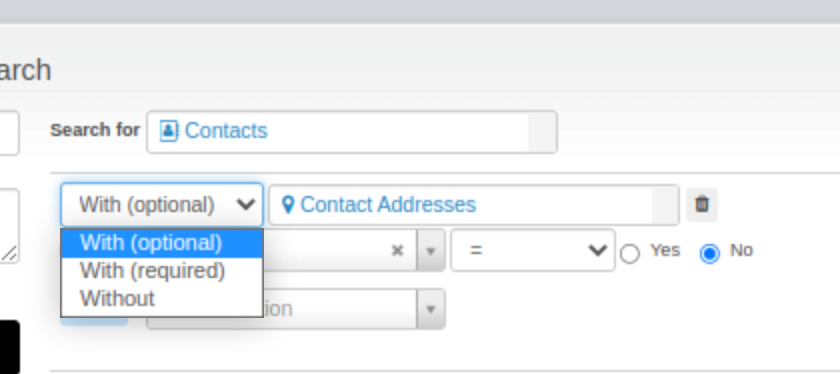
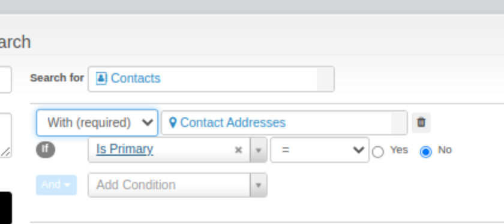
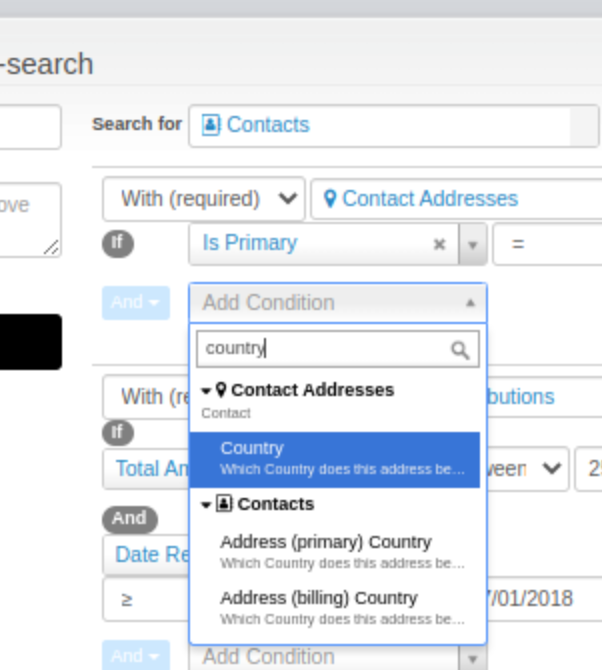

# What is SearchKit?

## About

SearchKit is a powerful search query builder with extensive options for displaying results. It is appropriate for site builders, power users and developers but non-technical staff are likely to need training or to spend some time learning the interface. Alternatively a more experienced user or developer may create SearchKit searches and make them available to other users via the menu system or as a dashlet on the main CiviCRM screen.

Searches built and saved in SearchKit can be targeted for use by different roles of staff users as well as unauthenticated end users.

## Getting started

You can access SearchKit under the menu **Search > SearchKit**.

## Concepts and terminology

Getting familiar with SearchKit requires some understanding of it's components and concepts. 
There are a number of recipes in this documentation for you to work through to get a better feel
for these but some introduction is needed.

### You find 'Entities'

An entity is a technical word for a 'thing'. In most cases the 'thing' (Entity) you want to search for will be something like a Contact, a Contribution etc. You start your search by selecting the entity you want to search for, or one of the several you want to find:

Within your search you can select fields to display. Some appear by default when you click Search. Then you can add others by clicking on the +Add on the right of the list of fields in your selected results, and selecting more fields. 

You can delete fields from appearing in the search results by clicking on the x beside the field name in the header row containing field titles of the search results.

### Filters / Criteria / Where

The Where section is where you define the criteria that relate to your entity.

In general, the operators are the same as the similarly-named SQL operators. Here are a few tips:
- `Matches Pattern` will match a regular expressions pattern.
- `Is Like` matches a complete field, so you usually want to use it with wildcards if you want to find parts of the field, like `%search term%`.
- `Contains` is useful for searching in serialized fields (fields that store multiple values together, such as Contact Subtype which could be `Parent,Volunteer,Staff`). It matches only a full value like `Parent`, not parts of a value.
- Negated operators such as `Not Like`, `≠` or `Doesn't Contain` won't match NULL fields that have no value. They only match fields that have a value and the value doesn't match the criteria. If you want NULL fields as well, you can search for `≠ searchterm OR Is Empty`.

The Having section is where you define any criteria to be applied after a 'Group By' (see further down).

### With (optional)/With (required)/Without (Joins)

You might want to find information that encompasses some columns of data that are not in the list available from the first entity selected. A join is the technical term for including more than one entity. In the UI you will see it
referred to as `With (optional)` / `With (required)` / `Without`. Once you join another entity using `With (optional)` you may have more rows - for
example in this case the search includes 'Contacts `with (optional)` Addresses'. The results
will have more rows for contacts with more than one address, and one row if they have no addresses or one address. By contrast, joining another entity using `With (required)` may reduce the number of rows returned. For example, 'Contacts `With (required)` Addresses' will not show contacts that have no addresses. If they have zero or one address they will have one
row. But if they have more than one then they will have one row per address -e.g here are the results
for Timmy & his parents where Timmy has one known address, Mum has 2 and Dad has none.

|Display Name|Location Type|Street Address|Is Primary|
|------------|-------------|--------------|----------|
|Timmy|Home|Sesame Street|Yes|
|Timmy's Mum|Home|Sesame Street|Yes|
|Timmy's Mum|Work|Downing Street|No|
|Timmy's Dad|||

There are 3 options for how to join

By changing between `with (required)`, `with (optional)` and `without` we change the search results completely.
Look at the image.

As selected it join will
- find contacts WITH more than one non-primary address.
  How is it finding only contacts with more than one address? The contact is `required` to be `with`
  and address that is not their primary address. Our result will look like

|Display Name|Location Type|Street Address|Is Primary|
|------------|-------------|--------------|----------|
|Timmy's Mum|Work|Downing Street|No|

- If `without` had been selected then it would only include contacts `without` any non-primary street
  addresses. This might mean they have only primary addresses, or that they have no addresses - it would find

|Display Name|Location Type|Street Address|Is Primary|
|------------|-------------|--------------|----------|
|Timmy||||
|Timmy's Dad|||

Note that although Timmy has an address it does not show up here because we have not included it
(used `with`), rather we used `without a non primary address`

### Group By
If, as in the above join example, you have one row per address but you just want one per contact
you can use Group By to group the rows, such that you only have one per contact.

### Addresses, emails & phones are a bit magic - that's mostly good
Normally a contact has a primary address, a primary email and a primary phone. We know there is only one
of each of these and they are really useful so you can include them without having to join in an address table. However,
if you DO include an address join you will see both fields from the 'Contact Entity' (primary
country) and the joined address and you need to match the field you pick up with the 'Entity name'
(ie what is in the box next to Required). Here 'Contact Addresses' are the non-primary ones
joined in and 'Address (primary) Country' is the primary address

### SearchDisplays

One search can have many Search Displays - although most often you will have zero or one. Search Displays are where
you configure things like links, specify fields to be editable or change the title of fields.
Your Search must have a search display if you want to add a Form.

### Forms

Forms are where you can configure for SearchKits to be shown as dashlets or in the menu. This is also 
where you configure filters.

## SearchKit and other CiviCRM search functionality

SearchKit fully replaces the old, more limited, Search Builder. 

It is more powerful than Advanced Search, and covers some extra parts of CiviCRM. However, many users may continue to prefer to use Advanced Search and searches like **Search > Find Contacts** and **Events > Find Participants**. We are no longer adding new features to these but they will be part of CiviCRM for the forseeable future.

The upper left Quick Search continues to be more convenient for quickly retrieving records based on part of an email or name or other single term. 

## Site Admin notes

### If SearchKit is missing.

On recent versions of CiviCRM SearchKit cannot be disabled. However, in the past SearchKit was not turned on when CiviCRM is installed. If it is not enabled on your site you can enable it on the Extensions screen. Navigate to **Administer > System Settings > Extensions**. Beside SearchKit, select the **Install** link then select the **Install** button.
