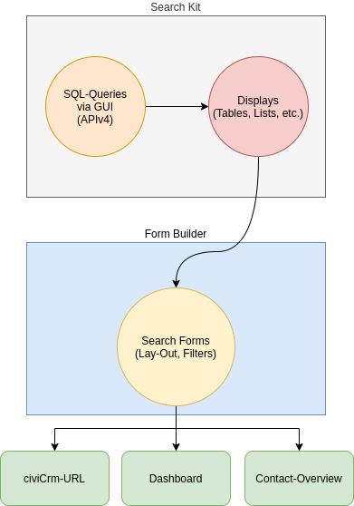

# What is SearchKit?

## About

SearchKit is a powerful search query builder with extensive options for display results. It is appropriate for site builders, power users and developers but not so much for non-technical staff working at non-profits. 

SearchKit searches can:

* be saved and exported,
* have any number of unique displays on their own,
* be connected to the dashboard, contact screen or individual URLs,
* have exposed filters for easy filtering,
* be connected to a Smart Group,
* be used for your own entities custom created for your website,
* be shipped with an additional extension.

## Getting started

SearchKit is not turned on when CiviCRM is installed. It appears as an extension which you can enable on the Extensions screen. Navigate to **Administer > System Settings > Extensions**. Beside SearchKit, select the **Install** link then select the **Install** button.

Once enabled you can access it under the menu **Search > SearchKit**.

## SearchKit and other CiviCRM search functionality

SearchKit fully replaces the old, more limited, Search Builder. 

It is more powerful than Advanced Search, and covers some extra parts of CiviCRM. Some users will find it more intuitive particularly if they understand SQL queries. Others will find its query building approach less understandable than the fields available in Advanced Search.

The upper left Quick Search continues to be more convenient for quickly retrieving records based on part of an email or name or other single term. 

Non-technical users daunted by SearchKit’s interface, and staff wanting quicker results for simple needs will likely prefer searches like **Search > Find Contacts** and **Events > Find Participants**.

Searches built and saved in SearchKit can be targeted for use by different roles of staff users as well as unauthenticated end users.

## SearchKit and FormBuilder

SearchKit and **[FormBuilder](/docs/the-user-interface/creating-new-forms.md)** work together to let users search for CiviCRM data and create new user interfaces without writing code. 

SearchKit’s Graphical User Interface lets you click, drag, drop and write. SearchKit builds and defines the underlying search and provides many ways to display it. FormBuilder shows end users filters and database actions, and provides more options for layout.

For developers, it is useful to know that they expose all the functionalities that are given by **APIv4**. They can be used in many ways, including adding new pages to CiviCRM, tabs to the Contact Summary page, or searchlets to the CiviCRM Dashboard.

