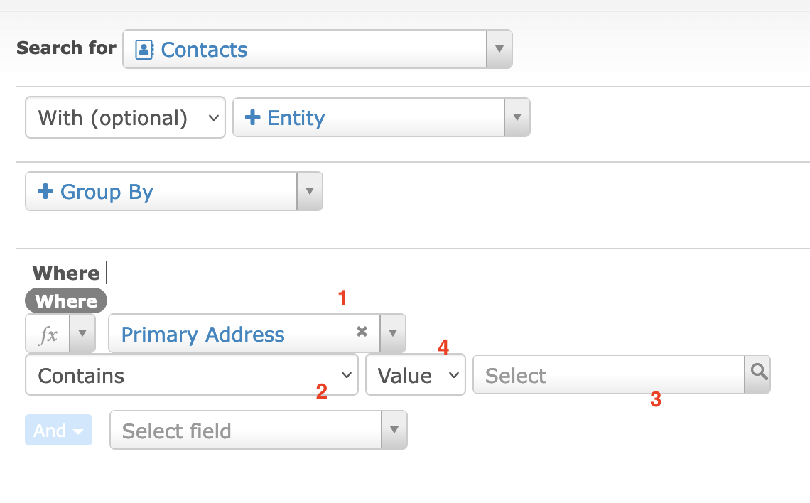
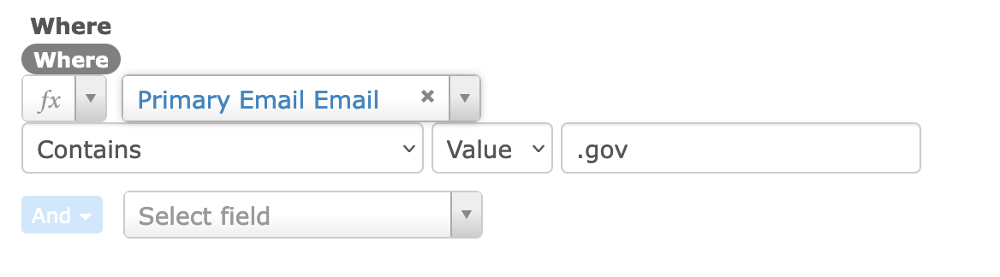
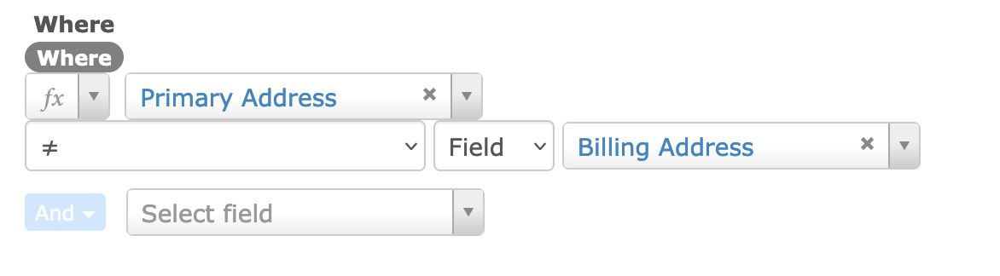

# Where

**Where** is how you build additional filters for the data type selected above. 

Provide a screenshot showing where on the SearchKit page this clause is.

## Description
There are four main components: 
1) the element you want to compare, 
2) the “operator” (things like equals, contains, is like) and 
3) value to compare against. 
4) Additionally you can choose whether to compare with a value you provide or the value of another field. Changing this will give you either an empty box for the value you want or a list of fields to compare against.
The “operators” contain math symbols  like equals and greater than, simple options like empty or not and various comparisons. 

You’re saying things like “**where** the email contains ‘.gov’ ” 

or “**where** the primary address is not the same as the billing address”

## Option Details

