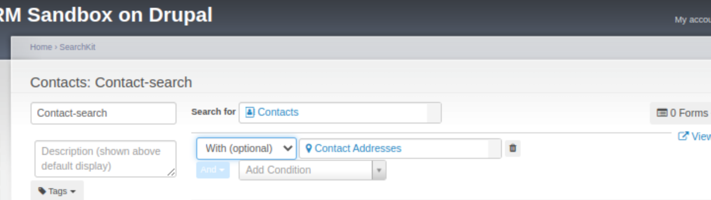

# With (Optional) / With (Required) / Without 

Put a short 1 - 2 sentence summary of function that will appear in-app on a popup (?) right after the Search For label.

Provide a screenshot showing where on the SearchKit page this clause is.

## Description

When you include more than one type of information (referred to as 'entities'), it's known as a join. In the user interface it is represented with the options "with (optional)", "with (required)" or "without". 

Keep in mind that adding an additional entity can change the number of rows in your results. For instance, let's consider a search that includes 'Contacts with (optional) Addresses'. In this scenario, the results will display differently based on the number of addresses associated with each contact.

- If a contact has no address or just one, they will appear in the results as a single row.
- If a contact has multiple addresses, there will be a separate row for each address.

Here's an example with Timmy and his parents:

|Display Name|Location Type|Street Address|Is Primary|
|------------|-------------|--------------|----------|
|Timmy|Home|Sesame Street|Yes|
|Timmy's Mum|Home|Sesame Street|Yes|
|Timmy's Mum|Work|Downing Street|No|
|Timmy's Dad|||

In this table (if you attach the addresses using the option "With optional" to the contacts):

- Timmy appears once as he has only one known address.
- Timmy's Mum appears twice, once for each of her two addresses (Home and Work).
- Timmy's Dad appears without any address details.

There are three options for joins in SearchKit: with (required), with (optional), and without. Each of these options significantly alters the search results. Here's how they differ:

- With (required): This option ensures that only those contacts with the specified additional information (like an address) are shown in the results.
- With (optional): Using this option, all contacts are shown in the results, but additional information is included where available.
- Without: This option includes only those contacts that do not have the specified additional information.

The choice of join option directly influences which contacts and what information is displayed in your search results.

## Option Details

If the section being described has a long list of options that have a one sentence description in the UI then probably start by just listing all of those options in an unordered list.
