# Creating new forms

CiviCRM ships with an extension that allows you to create your own forms.

The extension is called Form Builder (also known as Afform) and can be enabled
on the extensions page if not already installed.

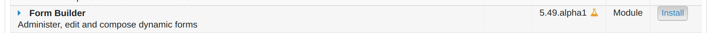

Once enabled, a Form Builder link will appear in the menu under
**Administer > Customize Data and Screens**.

Form Builder is excellent for when only a few fields are needed, such as in the image below that depict embedded form on a main dashboard that quickly creates and assigns activities of a particular type (i.e. schedule a phone call). The user only needs to enter the contacts involved, but has the option to add a subject and details.

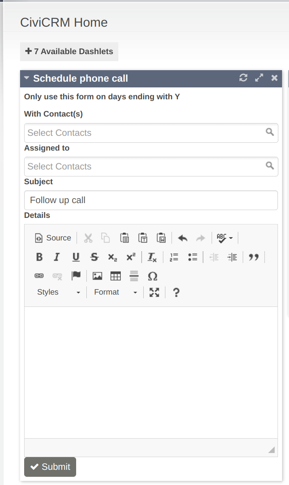

## Build a Form

1. ### Create the form
   Go to **Administer > Customize Data and Screens > Form Builder**

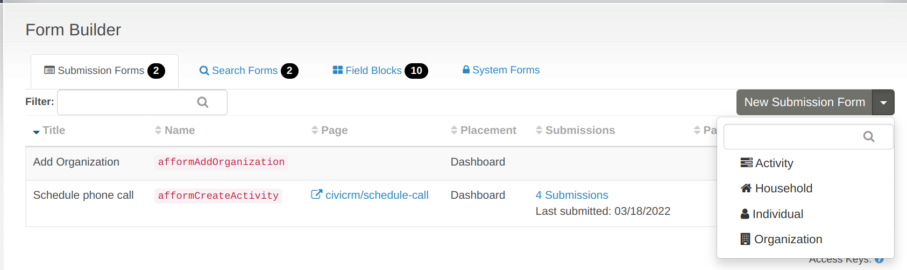

!!! Note
  Currently, only activity and contact related forms are offered, however, it is anticipated that other entities will be added soon (they can be added programatically).

1. ### Configure the form settings
  The form configuration screen can be broadly grouped into two parts:
    1. a configuration pane (left) that contains:
      * the title (required and visible on the form)
      * the description (highly recommended for clarity)
      * the permission required to access the form
      * the url at which the form will be found (must start with `civicrm/`)
      * a checkbox to add the form to the home dashboard
      * a checkbox that allows placement to be configured using Contact Layout Editor
  
  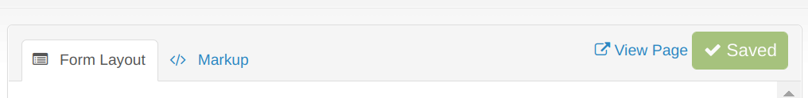

    2. a layout pane (right) that contains:
      * a display of what the form looks like 
      * settings icons on the fields
      * tabs to switch between the Form Layout and read-only auto-generated Markup
      * a **Save** button

  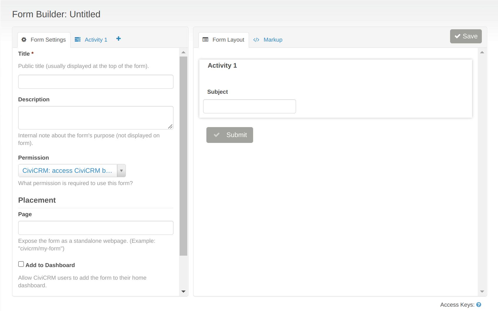

2. ### Build the form
On the left configuration pane, there are two tabs. The second tab displays the content, determined by which contact type or activtiy was chosen, that can be added to the form. Drag and drop the desired fields into the layout pane on the right, where they can be ordered and customized.

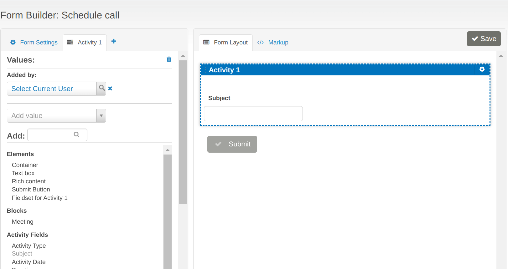

Under the Elements section, there are some formatting options that allow blocks of text, other html, and/or containers to group fields to be added.

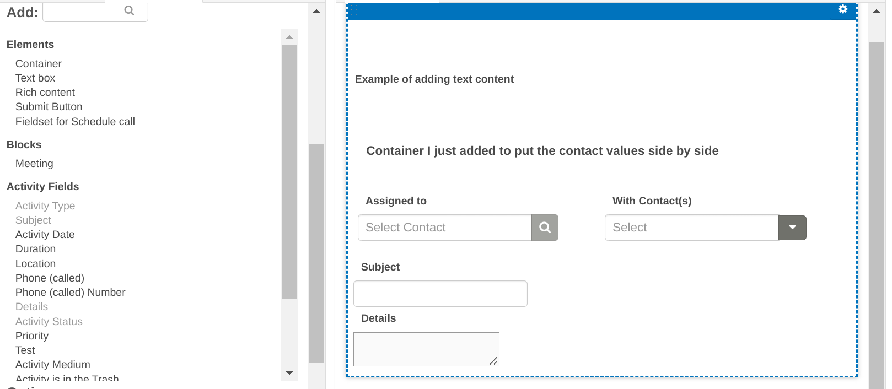

To the right of each field on the layout pane is a settings widget. This widget has options to:
  * change the widget for data entry (for example, if you choose RichTextEditor then a full WYSIWIG input widget will show up)
  * specifiy if the field is required
  * add a default value
  * specify if the label is shown
  * add any pre or post help text

Click on the layout elements to
  * rename the label
  * add placeholder text that will show in text boxes.

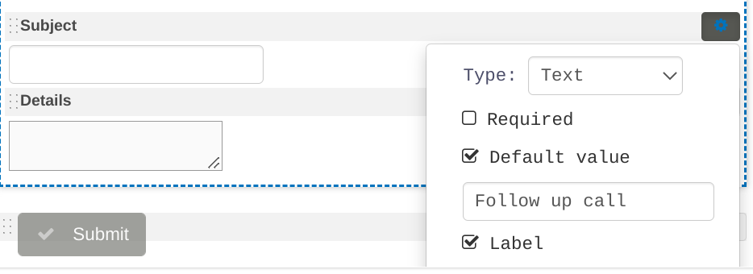

The html elements also have options

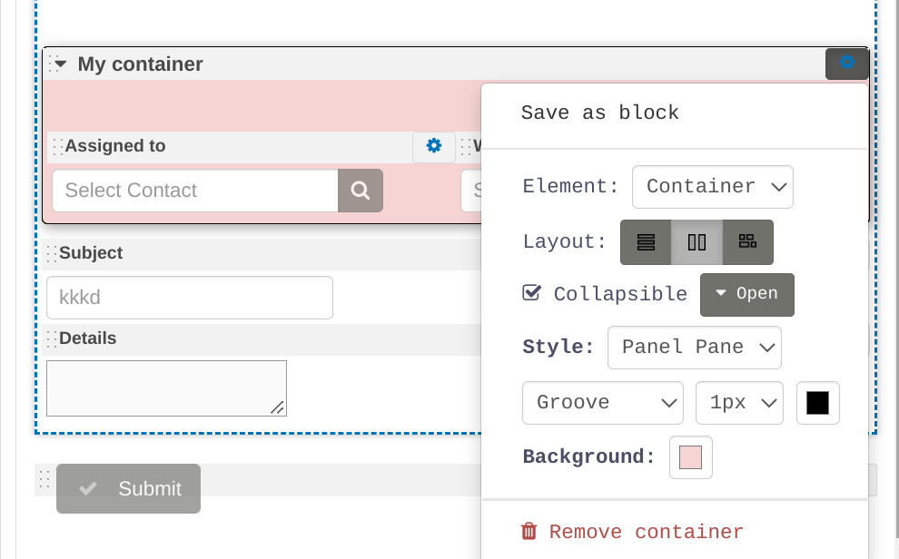

to customize the look and overlal layout of the form:

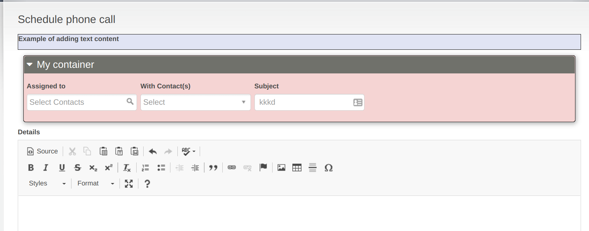

Containers can also be saved as blocks, which can then be used on other
forms as well. For example, a grouping of customized fields that are reused could be saved as a block and applied to multiple activity forms. Then, if that grouping of fields needs to be changed, the block would only have to be changed once instead of on each individual form.

And on the topic of reusable values, the **Values** section at the top of the left pane includes the option to pre-set data on the form. Continuing with the example from this section, the image below shows the renamed tab,'Schedule call', and three pre-set values. Having pre-set values can be useful if information, such as the Added by or Activity Status feilds, should be consistent across the form's submissions.

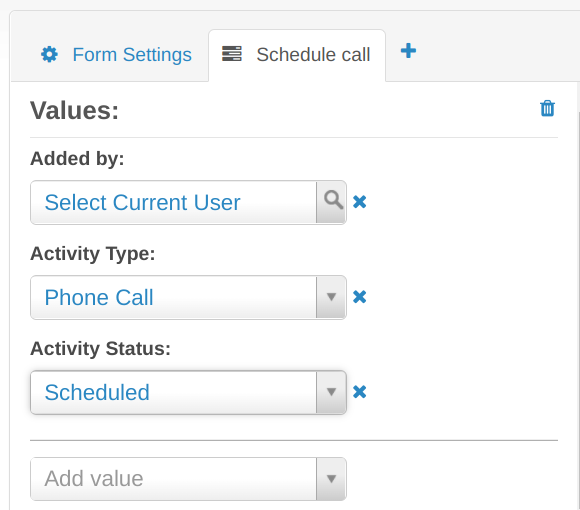

