# Search Kit

Search Kit is a new search interface to provide a more intuitive and powerful search than older CiviCRM search tools. Searches can be saved; have any number of unique displays on their own or connected to the dashboard or contact screen; have exposed filters for easy filtering; and even be connected to a Smart Group.

It ships as an extension which you can enable on the Extensions screen from 5.29 onwards. Once enabled it can be found under the menu **Search > Search Kit**.

!!! note 
    Search Kit ships as an extension as part of our strategy of
    putting significant functionality leaps into extensions rather than 
    overhauling existing code. This allows us to demarcate rapidly evolving
    code and to keep long-standing code more stable. People can opt into 
    the extension or not. However, it is maintained as part of core against
    the specific release it ships with (as it is closely tied to API v4
    functionality).

## Search components

There are 3 components to Search Kit: search screen, displays and forms. Depending on what you are doing you may not use all 3.

1. The Search screen (or Compose Search):

    This is where the search criteria and available fields are configured.

2. Displays
    
    Displays are optional. One or more can be added to a saved search. Search displays
    currently available are table views, list views, grid views, or smart groups.
     
3. Forms
    
    Forms allow a search to be displayed with exposed filters on a custom path, or
    in the dashboard or a contact screen. Note that, in order to add a form it is necessary to
    enable the _Form Builder_ (Afform GUI) extension that ships with core.

## The search screen

The search screen is reached from the search listing page (**Search > Search Kit**)

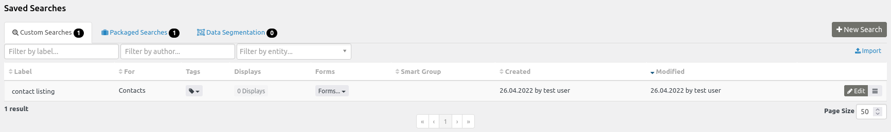

The screen below shows a very basic search for contacts filtered by those without a camera skill level (a custom field). 

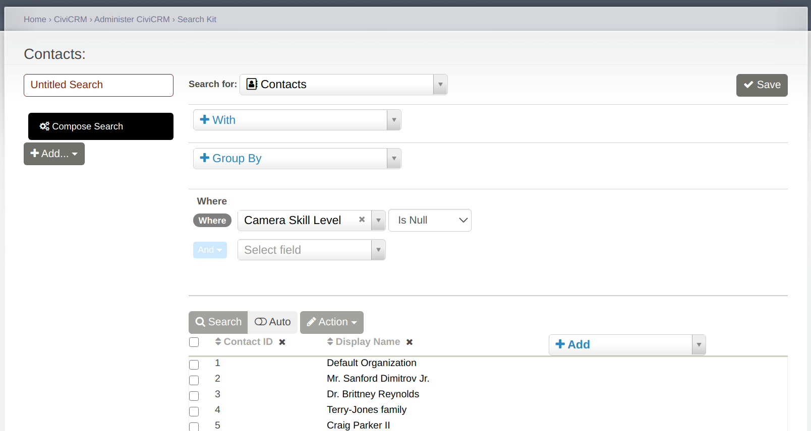

The search screen allows you to specify the entity that you wish to start
from; any entities you wish to also include; how you want to filter; group
and order the results and which field you wish to display. You are also
able to take actions directly on the results, such as: download as a spreadsheet,
tag, add to group, create mailing labels, update multiple contacts, and so on. 
(Unlike Advanced Search, Search Kit does not have a hard limit on the rows which can be updated at once.)

When searching the first thing you need to select is the entity you wish 
to search for. Some commonly used entities include:

- Contacts
- Activities
- Contributions
- Events
- Memberships
- Participants

Use the 'With' field to "chain" entities together. In SQL query language these 'with' entities are Joins.

The following example shows how to find all donors who made a donation of at least $100 but have never made a campaign contribution.

First choose to search for contacts.

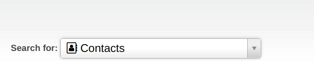

Next chain Contacts to Contact Contributions with the condition of contributions of $100 or more.

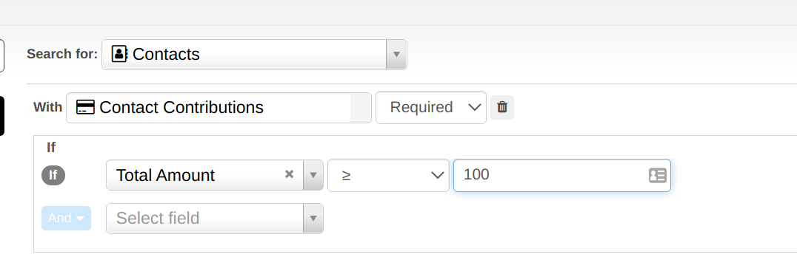

Note that in the image 'required' has been selected because we only want
contacts with contributions that match the criteria specified when we
add the contributions table. In this case the criteria is total amount 
of the contribution is greater than or equal to $100.

At this point it's helpful to check the results. At the bottom of the
page click search to see the results thus far. Click Add to add fields that help you to sanity
check your result.

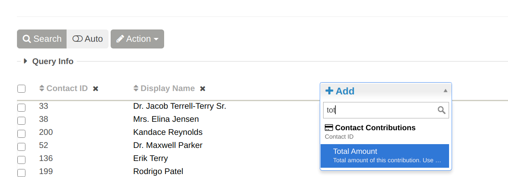

Now we're ready to exclude contacts who have made a campaign contribution. Add a second
entity which shows up as "Contact Contributions 2" under "With". Search Kit automatically numbers
additional entities of the same type so multiple ones can be added in the same search.

In this case we make Contact Contributions 2 option so we can exclude them. We filter on
'Campaign ID' is NOT empty. When adding this field be very careful to select
it from the second contribution table. We also need to select the
opposite criteria to what we want to know about. That is, we want to know about
those _don't_ have campaign contributions so we first include contributions with campaigns and then later filter them out.

To actually exclude them we also need to add 
a "Where" clause of Contribution ID "is Empty" to filter out the results of the entire search.

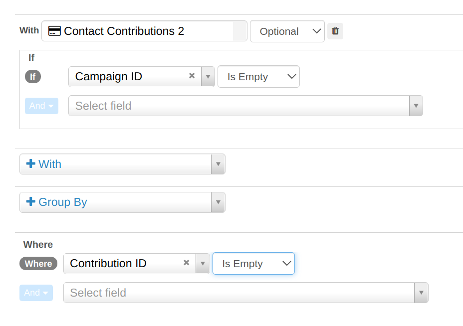

### Field transformations

It is possible to transform the individual field results. For example:

- Print a name in all uppercase
- Specify if a field is null (has no value). This will output Yes/No.
- Display just the year for a date field.
- Combine multiple fields into one string.

The available transformations depends on the field type. These transformations are, at core, SQL query transformations.
Try searching for something like "SQL Coalesce" to bring up helpful information.

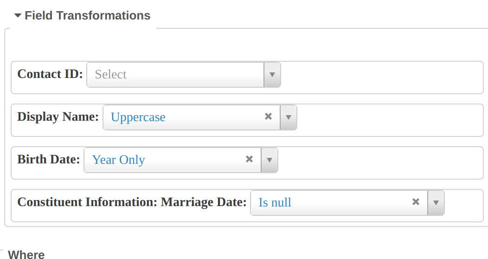

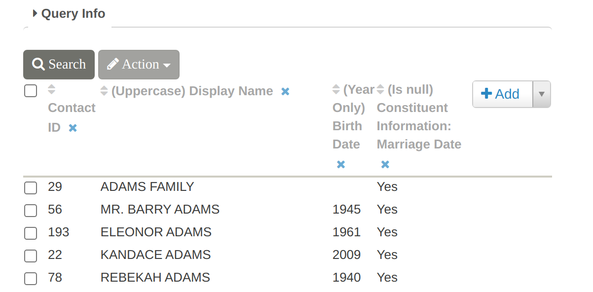

## Displays

Displays like table, list, grid provide an easy way to share the results of a saved search.
The display will not show the complex search query options. They can be added from the Search screen:

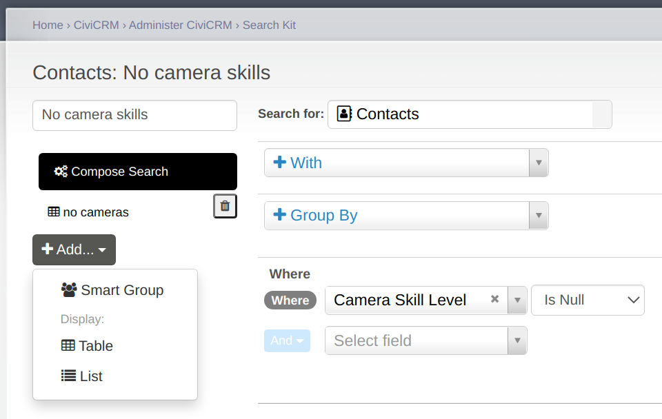

Displays can be customized to make them fit the results better with options like:

- custom title.
- sorting.
- row style.
- pager options.
- custom column headers and styles.
- linking the column result to the entity
- rewriting the column results with custom text or tokens.
- customisable action links

### Action links

There are several ways to create links from a display. Each individual field can have a link associated with it.
In the table below links have been configured both on the fields and as actions.

The contact id has been configured to have a pop up 'edit contact' modal. Note how in row 3 the contact ID is
not a link - this is because the contact does not have permission to edit that contact (the edit link at the
right is missing for the same reason). The display name has been configured to link to 'view the contact' in
a new window (the view contact screen does not look nice in a popup) and the email field will load
a popup to send an email. The same things have also been configured as action links on the right (mostly
for demo purposes). 

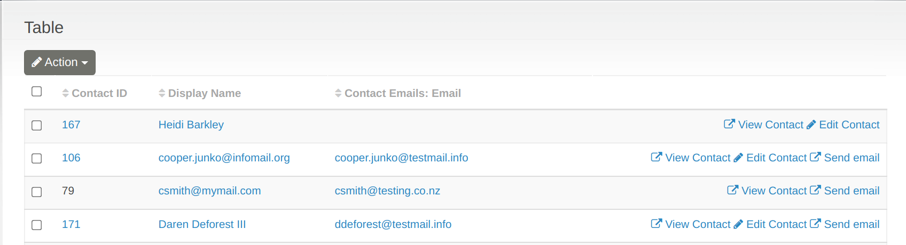

Note that the right hand buttons also include a 'delete action'. However, this is only visible
to the admin user who has permission to delete contacts.

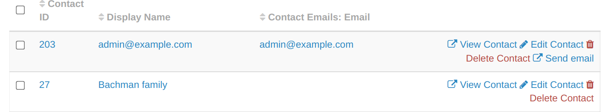

When configuring a link per field you can choose from the listed drop down ones or construct your
own.
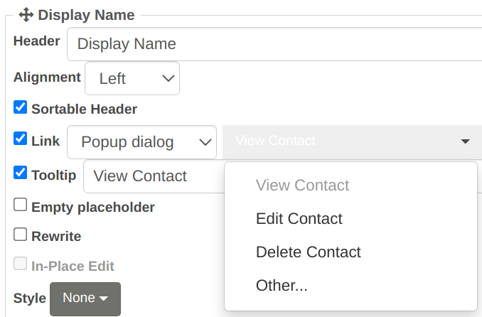

If you choose to construct your own you can use another field available to search kit as a parameter
in the url. In this case the email link is using email_id=[Contact_Email_contact_id_01.id] so that the
url will open with the chosen email id.

The configuration of the search actions is similar. As of 5.47 you can use conditions - such
as only display the send email action if email is not empty

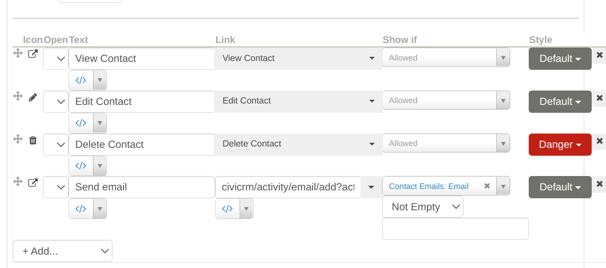

### URL filtering

It is possible to add parameters to the URL to filter a search display.
One useful way to use this is by having 2 searches. One uses group by
(e.g group contributions by payment instrument) and the other provides more
detail. In this example you would edit grouped search to have a link on
the payment method field. In the box would be the URL as per below but
for the 'value' a token would be used. In this case `[payment_instrument_id:label]`
(The box on the right helps with finding tokens.)

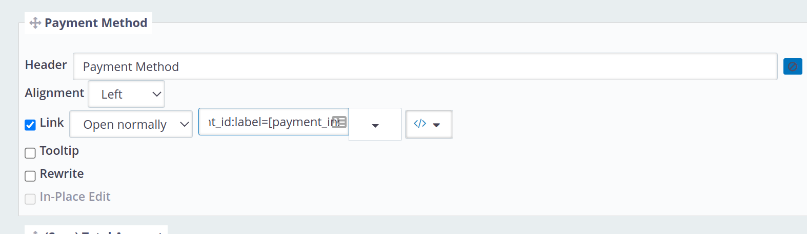

To get the syntax for a field in the search display click on 'rewrite'
to see the field name. For example, in this case we can see the field
name is 'payment_instrument_id:label'

We can add this to the saved search display url to filter by a particular 
payment method. For example, the URL to show cash only looks like
`civicrm/search#/display/my_contributions/my_contributions?payment_instrument_id:label=Cash`.
Both the saved search and the search display names are 'my_contributions' in this example.

A few notes about URL filters:

1) The field needs to be exposed in the search (but not necessarily the search display) to be available for filtering.
2) If the field is already filtered (e.g receive date before this week) then the URL filter will further narrow down the results rather than replace the existing filter.
3) When the field has a `:` in it that indicates that the field is a 'pseudoconstant'. The underlying database value is generally
a number which maps to a name and label. In this case the database field `payment_instrument_id` is a number. In some cases we know the number instead, in which case we could use `payment_instrument_id=1` in our URL or `payment_instrument_id:name=Cash`. This variant is more useful for implementers who work with multiple sites.
4) For dates we can use the following formats
   - `receive_date=2021-09-23`
   - `receive_date=20210923`
   - `receive_date=20210923234040` (i.e. time is 23:40:40)
   - `receive_date=this.month` (See [the list](../searching/relative-date-formats.md))

## Forms

Search forms enable exposed filters to be added to displays. Search forms (with the display) can be standalone web pages,
dashlets, summary on the Contact Summary Page, or as Email Tokens. For example:

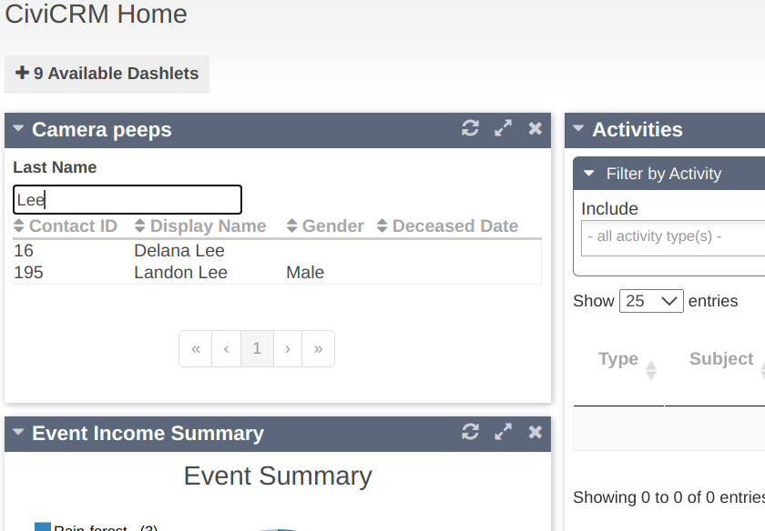

They are added via the search listing

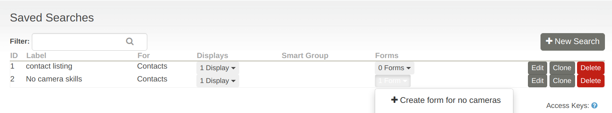

There are various settings for the form, such as the title, standalone URL and whether to also show it on the dashboard or contact summary page.

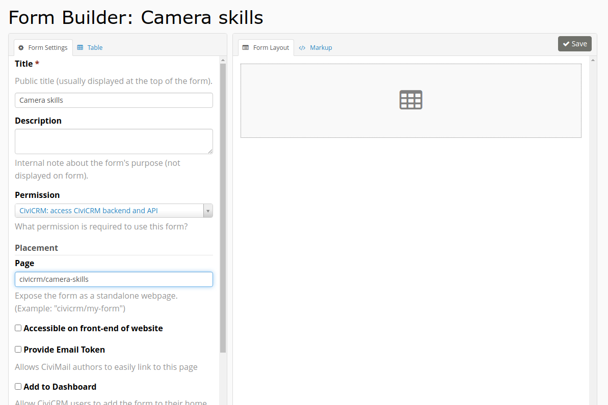

There's a tab for the display where we can drag and drop fields and form elements onto the Form Layout on the right.

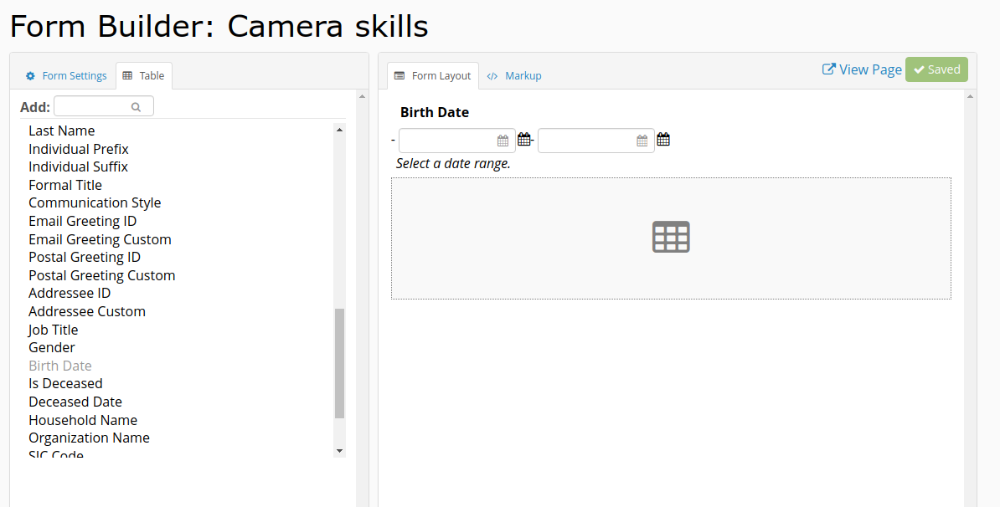

In this simple example, we've added Birth Date and adjusted the date settings to the date popup.

Once saved, there will be a View Page link which will open up the form in a new window. The form will include the display from the Saved Search.
Any changes to the filter will reload the results below it.